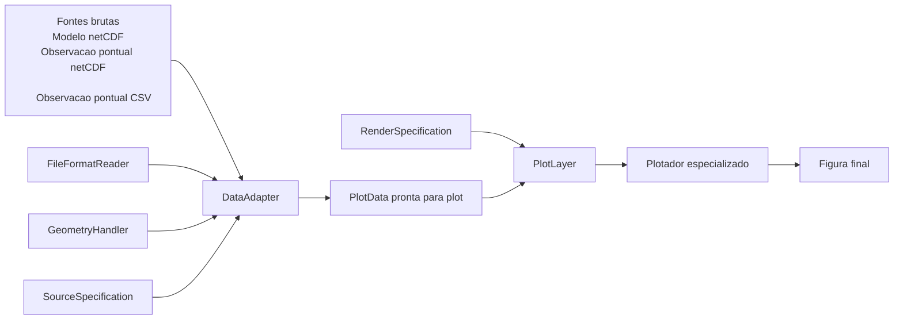

# Contexto de `plot_core`

Este documento registra a proposta de arquitetura para introduzir um modulo
`plot_core` no projeto `visualize_thesis`, com foco em desacoplar:

- preparo dos dados;
- abstracao das fontes comparaveis;
- metodos de plot por geometria.

O objetivo principal e permitir comparacoes flexiveis como:

- Modelo vs Modelo
- Modelo(s) vs ERA5
- Modelo(s) vs observacao

sem acoplar os metodos de plot a nomes fixos de modelos.

Neste contexto, `Modelo` significa qualquer fonte com grade estruturada.
O tratamento arquitetural deve ser o mesmo; o que pode variar entre fontes e:

- nome das coordenadas;
- nome das variaveis;
- unidades.

## Direcao de refatoracao do codigo existente

Esta arquitetura nao foi pensada para coexistir indefinidamente com os scripts
atuais da raiz do projeto fazendo toda a logica diretamente.

A direcao desejada e:

- os scripts atuais da raiz deixarem de manipular diretamente:
  - `xarray`
  - `matplotlib`
  - selecao espacial e temporal
  - conversao de unidades
  - derivacao de variaveis;
- e passarem a montar o fluxo por meio de:
  - `DataAdapter`
  - `PlotData`
  - `RenderSpecification`
  - `PlotLayer`
  - `PlotPanel`
  - `FigureSpecification`
  - `SpecializedPlotter`.

Em termos praticos:

- o novo `plot_core` deve concentrar o nucleo reutilizavel da arquitetura;
- os plots antigos devem ser gradualmente refatorados para virar modulos de
  "recipes" acima desse nucleo;
- esses modules de recipe devem orquestrar casos de uso concretos, preservando
  o comportamento cientifico dos plots antigos, mas sem reimplementar leitura,
  preparo e renderizacao de baixo nivel.
- esses recipes devem nascer flexiveis, de forma que adicionar ou remover
  camadas nao implique criar novas assinaturas inchadas com parametros
  repetidos por fonte ou por variavel;
- o crescimento funcional desejado deve acontecer por composicao de listas de
  entradas de camada e painel, e nao pela proliferacao de argumentos como
  `primary_`, `secondary_` ou equivalentes.
- em geracao batch de figuras, o fluxo externo deve reutilizar o mesmo
  `DataAdapter` por fonte e variar apenas as requests, evitando reabertura de
  datasets a cada iteracao do loop.

Exemplos esperados dessa migracao:

- [plot_profiles.py](/home/gfarache/git/visualize_thesis/legacy/code/plot_profiles.py)
  representa o fluxo legado que foi traduzido para recipes que instanciam
  `DataAdapter`s, solicitam `VerticalProfilePlotData`, montam `PlotLayer`s e
  chamam o `SpecializedPlotter`;
- [plot_diurnal.py](/home/gfarache/git/visualize_thesis/legacy/code/plot_diurnal.py)
  representa o fluxo legado que foi traduzido para recipes que montam
  `HorizontalFieldPlotData`, `TimeSeriesPlotData` ou
  `TimeVerticalSectionPlotData`, dependendo do caso, e organizam a figura pela
  nova estrutura.

## Problema atual

Os metodos de plot existentes ainda carregam conhecimento sobre pares
especificos de comparacao e nomes fixos de fontes. Isso torna mais dificil:

- reaproveitar metodos para outras comparacoes;
- incluir observacoes;
- incluir multiplos esquemas fisicos do mesmo modelo;
- evoluir para novos tipos de visualizacao.

## Objetivo arquitetural

Introduzir `plot_core` como o nucleo da arquitetura de visualizacao, cobrindo
do preparo dos dados ate os plotadores especializados, para que as figuras
sejam produzidas a partir de contratos claros em vez de datasets brutos.

Em outras palavras:

- `DataAdapter`s orquestram o preparo dos dados;
- `FileFormatReader`s leem e normalizam o formato bruto;
- `GeometryHandler`s interpretam a estrutura espacial da fonte;
- `SourceSpecification`s descrevem como interpretar variaveis, coordenadas e
  unidades;
- `plot_core` organiza contratos de `PlotData`, `RenderSpecification`,
  `PlotLayer` e
  plotadores especializados.

Exemplo curto de objetivo:

- comparar `theta` em perfis verticais de `MONAN_SHOC`, `MONAN_MYNN` e
  `GOAMAZON_RADIOSONDE`;
- produzir uma unica figura;
- com um painel por variavel;
- e uma curva por fonte dentro de cada painel.

## Visao geral do fluxo

