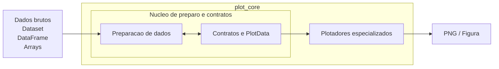

# Estrutura Macro de `plot_core`

Este documento descreve os blocos macro internos de `plot_core`, sem usar o
nivel de containers do C4. Classes e contratos internos, como
`DataAdapter`, `FileFormatReader`, `GeometryHandler`,
`SourceSpecification` e `PlotData`, pertencem ao nivel de componentes e sao
detalhados em [03-componentes.md](./03-componentes.md).

## Diagrama Macro

O diagrama abaixo representa organizacao macro e colaboracao entre blocos, nao
uma sequencia rigida de execucao.

## Bloco 1: Preparacao de dados

Responsavel por:

- ler o dado em disco para a memoria;
- selecionar ponto, area ou periodo;
- calcular medias temporais;
- converter unidades;
- calcular variaveis derivadas;
- regridar ou alinhar dados, quando necessario.

Esse bloco concentra a logica de leitura do dado bruto, interpretacao,
selecao e transformacao dos dados antes do plot.

Como regra de homogeneizacao, o resultado da leitura deve convergir para
`xarray.Dataset` antes das etapas seguintes do pipeline.

As pecas internas que realizam isso ficam no nivel de componentes. Em especial,
esse bloco abriga a colaboracao entre:

- `DataAdapter`
- `FileFormatReader`
- `GeometryHandler`
- `SourceSpecification`

O detalhamento dessas pecas fica em
[03-componentes.md](./03-componentes.md).

## Bloco 2: Contratos, `PlotData`, `RenderSpecification`, `PlotLayer`,
`PlotPanel` e `FigureSpecification`

Responsavel por:

- definir estruturas padrao de `PlotData` ja prontas;
- definir estruturas pequenas de `RenderSpecification` associadas a cada
  camada de render;
- definir a estrutura `PlotLayer`, que associa `PlotData` e
  `RenderSpecification` em uma camada renderizavel;
- definir a estrutura `PlotPanel`, que agrupa uma ou mais `PlotLayer`s em um
  subplot;
- definir uma `FigureSpecification` para organizar o layout completo da
  figura;
- definir contratos auxiliares como `SourceSpecification`;
- concentrar os contratos compartilhados entre os diferentes tipos de plot.

Nesse bloco tambem devem ficar os metadados e configuracoes necessarios para
que o plotador saiba como desenhar corretamente o dado, por exemplo:

- labels de eixos;
- unidades exibidas;
- limites de visualizacao sugeridos, como `vmin` e `vmax`;
- `colormap` sugerido;
- labels de legenda e titulos curtos, quando fizerem parte do contrato.

Para plots compostos, esse bloco tambem deve permitir combinar multiplas
`PlotLayer`, agrupa-las em `PlotPanel`s e organiza-las em uma figura.

Essa capacidade precisa ficar explicita:

- o mesmo subplot pode conter multiplos tipos de plot sobrepostos;
- a mesma figura pode conter multiplos subplots;
- portanto, a arquitetura deve suportar ao mesmo tempo:
  - composicao de diferentes renders dentro de um mesmo `PlotPanel`; e
  - composicao de varios `PlotPanel`s dentro da mesma imagem.

Cada `PlotLayer` e formada por:

- uma `PlotData`;
- uma `RenderSpecification`.

Exemplo:

- uma `PlotLayer` com `HorizontalFieldPlotData` para superficie colorida;
- outra `PlotLayer` com `HorizontalFieldPlotData` para isolinhas;
- cada camada com sua propria configuracao de render;
- ambas agrupadas no mesmo `PlotPanel`;
- multiplos `PlotPanel`s organizados por uma `FigureSpecification`.

Esse modulo nao deve:

- abrir arquivos;
- regridar dados;
- calcular variaveis derivadas;
- decidir logica cientifica de comparacao.

Em outras palavras:

- o Bloco 2 define o que precisa ser conhecido para plotar;
- o Bloco 3 define como isso sera desenhado na figura final.

## Bloco 3: Plotadores especializados

Responsavel por renderizar figuras para cada geometria:

- perfis verticais;
- secoes transversais verticais;
- series temporais;
- campos horizontais;
- ciclos diurnos.

Esse bloco e o responsavel por manipular diretamente a biblioteca de
renderizacao, atualmente `matplotlib`.

Esses modulos devem operar sobre `PlotPanel`s e `FigureSpecification`,
sem depender de nomes especificos como `monan_data` ou `e3sm_data`.

Esses plotadores nao devem receber:

- `DataAdapter`s;
- `FileFormatReader`s;
- `GeometryHandler`s;
- `SourceSpecification`s;
- `xarray.Dataset` bruto;
- observacoes em formato cru.

Eles devem receber apenas:

- `PlotPanel`s prontas; e
- uma `FigureSpecification`.

## Fora de `plot_core`: recipes de alto nivel

Fora do pacote `plot_core`, o projeto deve manter modulos de mais alto nivel
responsaveis por expressar casos de uso concretos.

Esses modulos funcionam como "recipes" da aplicacao.

Responsabilidades esperadas desses recipes:

- instanciar `DataAdapter`s;
- escolher requests concretos;
- solicitar `PlotData` ao core;
- montar `PlotLayer`s, `PlotPanel`s e `FigureSpecification`;
- chamar o `SpecializedPlotter`;
- lidar com detalhes de execucao do caso de uso, como:
  - iterar sobre tempos quando o usuario quiser um plot por tempo;
  - escolher quais fontes comparar;
  - salvar ou exibir a figura final.

Esses recipes nao devem reabsorver a logica que a arquitetura esta tentando
tirar dos scripts antigos.

Ou seja:

- nao devem voltar a manipular diretamente `xarray.Dataset` bruto para montar o
  plot;
- nao devem voltar a concentrar chamadas diretas de `matplotlib` para
  reconstruir renderizacao de baixo nivel;
- devem operar como clientes do `plot_core`, e nao como uma segunda
  implementacao paralela da mesma logica.

## Leitura correta deste nivel

Neste nivel arquitetural, dentro de `plot_core`:

- `Preparacao de dados` e um bloco macro;
- `Contratos, PlotData, RenderSpecification, PlotLayer, PlotPanel e
  FigureSpecification` e o bloco de contratos;
- `Plotadores especializados` e o bloco de renderizacao.

Ja neste mesmo contexto:

- `DataAdapter`
- `FileFormatReader`
- `GeometryHandler`
- `SourceSpecification`
- `RenderSpecification`
- `PlotLayer`
- `PlotPanel`
- `FigureSpecification`
- `VerticalProfilePlotData`
- `HorizontalFieldPlotData`
- `VerticalCrossSectionPlotData`
- `TimeSeriesPlotData`

nao sao blocos macro. Eles sao componentes internos desses blocos.
