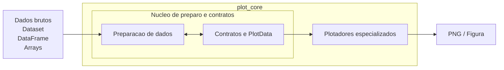

# Estrutura Macro de `plot_core`

Este documento descreve os blocos macro internos de `plot_core`, sem usar o
nivel de containers do C4. Classes e contratos internos, como
`DataAdapter`, `FileFormatHandler`, `GeometryHandler`,
`SourceSpecification` e `PlotData`, pertencem ao nivel de componentes e sao
detalhados em [03-componentes.md](./03-componentes.md).

## Diagrama Macro

O diagrama abaixo representa organizacao macro e colaboracao entre blocos, nao
uma sequencia rigida de execucao.

## Bloco 1: Preparacao de dados

Responsavel por:

- ler o dado em disco para a memoria;
- selecionar ponto, area ou periodo;
- calcular medias temporais;
- converter unidades;
- calcular variaveis derivadas;
- regridar ou alinhar dados, quando necessario.

Esse bloco concentra a logica de leitura do dado bruto, interpretacao,
selecao e transformacao dos dados antes do plot.

As pecas internas que realizam isso ficam no nivel de componentes. Em especial,
esse bloco abriga a colaboracao entre:

- `DataAdapter`
- `FileFormatHandler`
- `GeometryHandler`
- `SourceSpecification`

O detalhamento dessas pecas fica em
[03-componentes.md](./03-componentes.md).

## Bloco 2: Contratos, `PlotData` e `RenderSpecification`

Responsavel por:

- definir estruturas padrao de `PlotData` ja prontas;
- definir estruturas pequenas de `RenderSpecification` associadas a cada
  camada de render;
- definir contratos auxiliares como `SourceSpecification`;
- concentrar os contratos compartilhados entre os diferentes tipos de plot.

Nesse bloco tambem devem ficar os metadados e configuracoes necessarios para
que o plotador saiba como desenhar corretamente o dado, por exemplo:

- labels de eixos;
- unidades exibidas;
- limites de visualizacao sugeridos, como `vmin` e `vmax`;
- `colormap` sugerido;
- labels de legenda e titulos curtos, quando fizerem parte do contrato.

Para plots compostos, esse bloco tambem deve permitir combinar multiplos
`PlotData`, cada um com sua propria `RenderSpecification`.

Exemplo:

- uma `HorizontalFieldPlotData` para superficie colorida;
- outra `HorizontalFieldPlotData` para isolinhas;
- cada uma com sua propria configuracao de render.

Esse modulo nao deve:

- abrir arquivos;
- regridar dados;
- calcular variaveis derivadas;
- decidir logica cientifica de comparacao.

Em outras palavras:

- o Bloco 2 define o que precisa ser conhecido para plotar;
- o Bloco 3 define como isso sera desenhado na figura final.

## Bloco 3: Plotadores especializados

Responsavel por renderizar figuras para cada geometria:

- perfis verticais;
- series temporais;
- campos horizontais;
- ciclos diurnos.

Esses modulos devem operar sobre `PlotData` prontas, sem depender de nomes
especificos como `monan_data` ou `e3sm_data`.

Esses plotadores nao devem receber:

- `DataAdapter`s;
- `FileFormatHandler`s;
- `GeometryHandler`s;
- `SourceSpecification`s;
- `xarray.Dataset` bruto;
- observacoes em formato cru.

Eles devem receber apenas instancias prontas de `PlotData`.

## Leitura correta deste nivel

Neste nivel arquitetural, dentro de `plot_core`:

- `Preparacao de dados` e um bloco macro;
- `Contratos, PlotData e RenderSpecification` e o bloco de contratos;
- `Plotadores especializados` e o bloco de renderizacao.

Ja neste mesmo contexto:

- `DataAdapter`
- `FileFormatHandler`
- `GeometryHandler`
- `SourceSpecification`
- `RenderSpecification`
- `ProfilePlotData`
- `HorizontalFieldPlotData`
- `TimeSeriesPlotData`

nao sao blocos macro. Eles sao componentes internos desses blocos.
