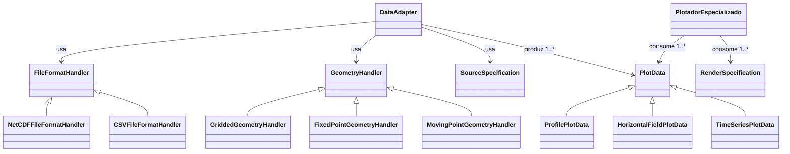
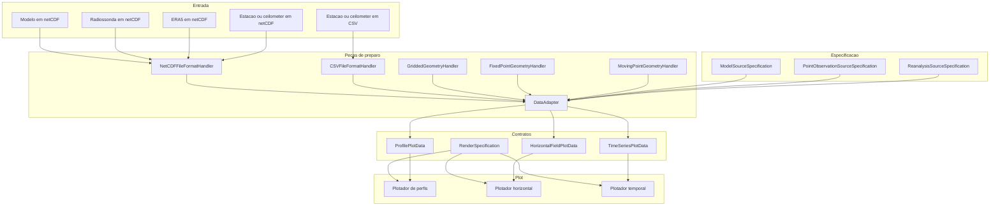

# Componentes de `plot_core`

## `ProfilePlotData`

Representa dados prontos para plot em perfis verticais.

Campos sugeridos:

- `label`
- `profiles`
- `y_values`
- `vertical_axis`
- `units`
- `cloud_mask`
- `coordinate_label`

Uso esperado:

- perfil vertical de modelo;
- perfil vertical observado;
- media temporal de perfis.

## `HorizontalFieldPlotData`

Representa dados prontos para plot em mapas e produtos horizontais.

Campos sugeridos:

- `label`
- `field`
- `lon`
- `lat`
- `units`
- `time_label`
- `mask`

Uso esperado:

- campos instantaneos;
- medias temporais;
- amplitude de ciclo diurno;
- fase de pico;
- modelo, ERA5 ou observacao gridded.

## `TimeSeriesPlotData`

Representa dados prontos para plot em series temporais.

Campos sugeridos:

- `label`
- `times`
- `values`
- `units`
- `site_label`

Uso esperado:

- series temporais em observacoes pontuais em sitio fixo;
- series temporais em estacoes de superficie, torres de fluxo ou sensores como
  ceilometer;
- comparacao modelo vs observacao;
- comparacao entre configuracoes do mesmo modelo.

## `RenderSpecification`

`RenderSpecification` descreve como uma camada especifica de `PlotData` deve
ser renderizada.

Campos sugeridos:

- `render_kind` (`surface`, `contour`, `line`, `scatter`, `vector`, `hatch`)
- `label`
- `units_label`, quando fizer sentido sobrescrever a exibicao
- `cmap`
- `vmin`
- `vmax`
- `levels`
- `colors`
- `linestyle`
- `linewidth`
- `marker`
- `alpha`
- `zorder`

Essa separacao e util para desacoplar:

- o conteudo do dado pronto para plot; e
- a forma como cada camada sera desenhada.

Com isso, plots compostos podem ser formados por multiplos `PlotData`, cada um
com sua propria `RenderSpecification`.

## `SourceSpecification`

`SourceSpecification` descreve como uma determinada fonte deve ser interpretada
antes de virar uma ou mais `PlotData`.

Campos sugeridos:

- `label`
- nomes das coordenadas (`lat`, `lon`, `time`, `vertical`)
- nomes das variaveis de interesse
- unidades de entrada ou unidade alvo
- configuracoes de conversao necessarias
- aliases de variaveis, quando necessario
- regras de derivacao, quando uma variavel precisa ser montada a partir de
  outras

Seu papel e permitir que a mesma arquitetura trate fontes diferentes com a
mesma logica, mesmo quando mudam:

- nome das coordenadas;
- nome das variaveis;
- unidades.

Exemplos de especializacao:

- `ModelSourceSpecification`
- `ReanalysisSourceSpecification`
- `PointObservationSourceSpecification`

## `FileFormatHandler`

`FileFormatHandler` define como abrir e normalizar o formato bruto da fonte.

Exemplos:

- `NetCDFFileFormatHandler`
- `CSVFileFormatHandler`

Responsabilidades esperadas:

- abrir com a biblioteca adequada, como `xarray` ou `pandas`;
- normalizar a estrutura minima de entrada para a etapa seguinte;
- lidar com parsing basico de tempo, colunas e tipos;
- devolver um objeto interno consistente para o `DataAdapter`.

Em resumo:

- `FileFormatHandler` responde "como ler este formato?"

## `GeometryHandler`

`GeometryHandler` define como interpretar a estrutura espacial da fonte.

Exemplos:

- `GriddedGeometryHandler`
- `FixedPointGeometryHandler`
- `MovingPointGeometryHandler`

Responsabilidades esperadas:

- descrever se a fonte e grade estruturada, ponto fixo ou ponto movel;
- explicitar se latitude/longitude sao fixas ou variam no tempo;
- definir regras estruturais de selecao espacial;
- fornecer ao `DataAdapter` a leitura correta da geometria horizontal.

Observacao importante:

- `FixedPoint` significa apenas que a amostragem horizontal e fixa;
- a fonte ainda pode ter dimensao vertical, como no caso de um ceilometer em
  sitio fixo.

Em resumo:

- `GeometryHandler` responde "como esta fonte se organiza no espaco?"

## `DataAdapter`

`DataAdapter` e a classe orquestradora da preparacao de dados.

Ela combina:

- um `FileFormatHandler`;
- um `GeometryHandler`;
- uma `SourceSpecification`.

Seu papel nao e concentrar toda a logica em uma classe monolitica, mas montar
as pecas necessarias para preparar a fonte.

## Diagrama de relacao entre classes

Leitura correta desse diagrama:

- `SourceSpecification` entra no `DataAdapter` como especificacao de leitura e
  interpretacao da fonte;
- `SourceSpecification` nao acompanha obrigatoriamente a `PlotData`;
- cada camada de `PlotData` e associada a uma `RenderSpecification` no momento
  de renderizacao;
- um mesmo plot pode consumir multiplas `PlotData`, cada uma com sua propria
  `RenderSpecification`.

## Compatibilidade entre `GeometryHandler` e `PlotData`

Essa relacao existe como restricao de compatibilidade, mas nao deve ser tratada
como acoplamento estrutural rigido.

Em outras palavras:

- o `GeometryHandler` restringe quais tipos de `PlotData` o `DataAdapter` pode
  produzir;
- a decisao final ainda depende das dimensoes disponiveis e do tipo de saida
  desejado.

Casos esperados:

- `GriddedGeometryHandler`
  - pode produzir `HorizontalFieldPlotData`
  - pode produzir `ProfilePlotData`, quando houver dimensao vertical
  - pode produzir `TimeSeriesPlotData`, quando houver selecao temporal pontual

- `FixedPointGeometryHandler`
  - pode produzir `TimeSeriesPlotData`
  - pode produzir `ProfilePlotData`, quando houver dimensao vertical
  - nao deve produzir `HorizontalFieldPlotData`

- `MovingPointGeometryHandler`
  - pode produzir `ProfilePlotData`
  - pode produzir `TimeSeriesPlotData`, quando houver serie associada ao ponto
    movel
  - nao deve produzir `HorizontalFieldPlotData`

Consequencia para a implementacao:

- o `DataAdapter` deve validar se a combinacao entre `GeometryHandler` e o tipo
  de `PlotData` solicitado e suportada;
- combinacoes impossiveis devem falhar cedo, com erro explicito.

## `DataAdapter` vs `PlotData`

Esta distincao precisa ficar explicita:

- `DataAdapter` = componente/classe que prepara o dado
- `PlotData` = estrutura que carrega o dado pronto para plot

Tambem precisamos separar duas dimensoes diferentes:

- `FileFormatHandler` e orientado ao tipo de entrada/origem/formato;
- `GeometryHandler` e orientado a estrutura espacial da fonte;
- `SourceSpecification` e orientada ao significado das variaveis, coordenadas e
  unidades;
- `DataAdapter` compoe essas pecas;
- `PlotData` e orientada ao tipo geometrico do plot;
- `RenderSpecification` e orientada ao papel visual de cada camada.

Exemplos:

- `NetCDFFileFormatHandler`
- `CSVFileFormatHandler`
- `GriddedGeometryHandler`
- `FixedPointGeometryHandler`
- `MovingPointGeometryHandler`

Essas pecas podem produzir diferentes tipos de `PlotData`, conforme o
caso de uso:

- `ProfilePlotData`
- `HorizontalFieldPlotData`
- `TimeSeriesPlotData`

Essas `PlotData` podem ser combinadas em uma mesma figura, desde que cada uma
tenha uma `RenderSpecification` compativel com o plotador.

### O que o `DataAdapter` faz

O `DataAdapter` recebe algo cru, por exemplo:

- `xarray.Dataset`
- `DataFrame`
- arrays observacionais

e executa tarefas como:

- usar um `FileFormatHandler` para abrir e normalizar a fonte;
- usar um `GeometryHandler` para interpretar a estrutura espacial;
- aplicar uma `SourceSpecification`;
- selecionar ponto;
- escolher datas;
- fazer media temporal;
- converter unidade;
- calcular variavel derivada;
- organizar eixos.

Ao final, o `DataAdapter` devolve uma ou mais `PlotData`.

### O que a `PlotData` contem

A `PlotData` e o resultado desse preparo. Ela contem o dado pronto para plot,
enquanto a `RenderSpecification` descreve como essa camada deve ser desenhada.

Exemplo para perfil vertical:

- `label`
- `profiles`
- `y_values`
- `cloud_mask`
- `units`

### Regra de arquitetura

Os `DataAdapter`s nao precisam proliferar por instrumento ou por produto.
O importante e que sejam montados a partir de pecas menores e reutilizaveis.

Exemplos:

- modelo em grade:
  - `NetCDFFileFormatHandler`
  - `GriddedGeometryHandler`
  - `ModelSourceSpecification`
- radiossonda em netCDF:
  - `NetCDFFileFormatHandler`
  - `MovingPointGeometryHandler`
  - `PointObservationSourceSpecification`
- estacao de superficie em CSV:
  - `CSVFileFormatHandler`
  - `FixedPointGeometryHandler`
  - `PointObservationSourceSpecification`
- ceilometer em netCDF ou CSV:
  - `NetCDFFileFormatHandler` ou `CSVFileFormatHandler`
  - `FixedPointGeometryHandler`
  - `PointObservationSourceSpecification`

Isso nao e problema, desde que todos devolvam o mesmo contrato final de
`PlotData` compativel com o plotador.

### O que o plotador recebe

O plotador nao recebe:

- `DataAdapter`;
- `FileFormatHandler`;
- `GeometryHandler`;
- `SourceSpecification`;
- dado ainda nao organizado em camadas de render;
- dado bruto;
- regra de preprocessamento.

O plotador recebe `PlotData`s prontas e suas `RenderSpecification`s.

Em resumo:

- `DataAdapter` = processo
- `PlotData` = resultado do processo
- `RenderSpecification` = instrucao de render por camada

## Diagrama de componentes

## Relacao entre componentes

Fluxo proposto:

1. Um `DataAdapter` recebe dados brutos, um `FileFormatHandler`, um
   `GeometryHandler` e uma `SourceSpecification`.
2. O `DataAdapter` usa essas pecas para ler, interpretar e preparar os dados.
3. O `DataAdapter` devolve uma ou mais instancias de `ProfilePlotData`,
   `HorizontalFieldPlotData` ou `TimeSeriesPlotData`.
4. Cada `PlotData` e associada a uma `RenderSpecification`.
5. O metodo de plot recebe uma ou mais camadas prontas para render.
6. O plotador renderiza a figura sem conhecer a origem dos dados.

No caso de comparacao entre perfil vertical de modelo e radiossonda:

1. `NetCDFFileFormatHandler` + `GriddedGeometryHandler` +
   `ModelSourceSpecification` produzem uma `ProfilePlotData`.
2. `NetCDFFileFormatHandler` + `MovingPointGeometryHandler` +
   `PointObservationSourceSpecification` produzem outra `ProfilePlotData`.
3. O plotador de perfis recebe as duas `ProfilePlotData`s, com suas
   `RenderSpecification`s, e desenha juntas.

No caso de um mapa com superficie colorida e isolinhas:

1. uma `HorizontalFieldPlotData` representa o campo da superficie;
2. outra `HorizontalFieldPlotData` representa o campo das isolinhas;
3. cada uma recebe sua propria `RenderSpecification`;
4. o plotador horizontal compoe as duas camadas na mesma figura.

Consequencia importante:

- pode haver diferentes combinacoes de `FileFormatHandler`,
  `GeometryHandler` e `SourceSpecification`;
- desde que o `DataAdapter` devolva as `PlotData` esperadas e cada camada tenha
  uma `RenderSpecification` compativel, essas fontes podem ser usadas juntas
  na mesma figura.
