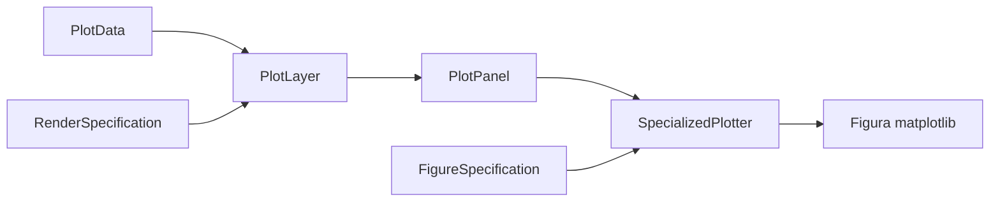
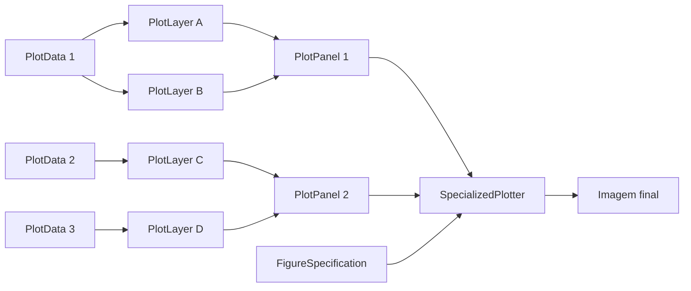

# Renderizacao

## Visao geral

Este documento descreve os contratos que ligam dado pronto para plot com a
figura final.

Premissa importante desta arquitetura:

- a biblioteca de plot e `matplotlib`;
- a camada de renderizacao deve funcionar como uma interface fina entre o
  usuario e a chamada do metodo do `matplotlib`;
- a arquitetura nao deve engessar a customizacao de argumentos especificos dos
  metodos de plot.

## `RenderSpecification`

`RenderSpecification` descreve como uma camada especifica de `PlotData` deve
ser renderizada.

Campos sugeridos:

- `artist_method`
- `artist_kwargs`

Essa separacao e util para desacoplar:

- o conteudo do dado pronto para plot; e
- a forma como cada camada sera desenhada.

Leitura correta:

- `artist_method`
  - nome do metodo do `matplotlib.axes.Axes` que deve ser chamado;
  - exemplos: `plot`, `contour`, `contourf`, `pcolormesh`;
- `artist_kwargs`
  - dicionario com os kwargs que devem ser repassados diretamente para esse
    metodo do `matplotlib`;

Com essa modelagem:

- o usuario mantem liberdade para passar parametros especificos do metodo do
  `matplotlib` sem esperar que a arquitetura modele cada argumento;
- o `SpecializedPlotter` fica responsavel apenas por:
  - selecionar os arrays corretos em `PlotData`;
  - chamar o metodo indicado em `artist_method`;
  - repassar `artist_kwargs` diretamente para o `matplotlib`.

Exemplos curtos:

```python
RenderSpecification(
    artist_method="plot",
    artist_kwargs={"color": "black", "linewidth": 2.0, "linestyle": "--"},
)
```

```python
RenderSpecification(
    artist_method="contourf",
    artist_kwargs={"levels": 21, "cmap": "viridis", "extend": "both"},
)
```

```python
RenderSpecification(
    artist_method="contour",
    artist_kwargs={"levels": [0.1, 0.5, 1.0], "colors": "k", "linewidths": 0.8},
)
```

## `ColorbarSpecification`

`ColorbarSpecification` descreve a colorbar de um `PlotPanel`.

Campos sugeridos:

- `source_layer_index`
- `colorbar_kwargs`

Leitura correta:

- `source_layer_index`
  - indica qual item de `layers` fornece o artist mapeavel usado na colorbar;
- `colorbar_kwargs`
  - kwargs repassados para a criacao/configuracao da colorbar.

Regra do MVP:

- um `PlotPanel` pode ter no maximo uma `ColorbarSpecification`;
- essa escolha evita repetir configuracao de colorbar em varias `PlotLayer`s;
- se `source_layer_index` apontar para uma camada que nao produza artist
  mapeavel, o `SpecializedPlotter` deve falhar com erro explicito.

## `PlotLayer`

`PlotLayer` representa uma camada renderizavel.

Ela associa:

- uma `PlotData`;
- uma `RenderSpecification`.

Com isso:

- o `PlotData` continua sendo um contrato puro de dado;
- a `RenderSpecification` continua sendo um contrato puro de render.

Regra importante:

- se uma sobreposicao visual representar um dado adicional, como nebulosidade
  hachurada, mascara diagnostica ou regiao destacada, essa sobreposicao deve
  preferencialmente virar outra `PlotLayer`;
- o `draw_mask` de uma `PlotData` deve ser reservado principalmente para
  ocultar ou invalidar pontos da propria camada.

## `PlotPanel`

`PlotPanel` representa um subplot individual dentro de uma figura.

Ela agrupa:

- uma ou mais `PlotLayer`s;
- metadados especificos do painel.

Campos sugeridos:

- `layers`
- `axes_set_kwargs`, opcional
- `grid_kwargs`, opcional
- `legend_kwargs`, opcional
- `colorbar_specification`, opcional
- `axes_calls`, opcional

Uso esperado:

- um painel de perfil vertical para uma variavel;
- um painel horizontal com superficie colorida e isolinhas;
- um painel temporal com uma ou mais fontes comparadas.

Caso mais simples que precisa ficar explicito:

- uma figura pode conter apenas um unico `PlotPanel`;
- nesse caso, a figura tera apenas um subplot;
- essa possibilidade deve existir de forma natural, sem exigir uma estrutura
  diferente da usada para multiplos paineis.

No caso de paineis multi-fonte:

- cada fonte gera sua propria `PlotLayer`;
- todas as camadas da mesma variavel entram no mesmo `PlotPanel`.

Capacidade importante que deve permanecer explicita:

- um mesmo `PlotPanel` deve poder combinar diferentes tipos de render no mesmo
  subplot;
- isso inclui, por exemplo:
  - `contourf` + `contour`;
  - multiplas curvas de perfil vertical na mesma area de plot;
  - campo preenchido + mascara/hachura;
  - observacao e multiplos modelos sobrepostos.

Regra de compatibilidade importante:

- `PlotLayer`s com tipos diferentes de `PlotData` podem coexistir no mesmo
  `PlotPanel` apenas quando compartilharem a mesma semantica de eixos do
  subplot;
- em outras palavras, o painel pode misturar tipos diferentes de `PlotData`,
  mas nao pode misturar geometrias incompatíveis;
- exemplo valido:
  - `TimeVerticalSectionPlotData` + `TimeSeriesPlotData`, quando a serie
    temporal ja estiver preparada para o mesmo sistema de eixos do painel, como
    `hpbl` convertido para pressao equivalente;
- exemplo invalido:
  - `HorizontalFieldPlotData` + `TimeSeriesPlotData` no mesmo painel;
- combinacoes incompatíveis devem falhar cedo no `SpecializedPlotter`.

Exemplo conceitual importante:

- se o usuario quiser um campo de superficie colorido e uma isolinha no mesmo
  subplot;
- entao ele cria:
  - uma `PlotLayer` com `artist_method="contourf"`;
  - outra `PlotLayer` com `artist_method="contour"`;
- as duas entram na lista `layers` do mesmo `PlotPanel`.

Leitura correta dos campos do painel:

- `layers`
  - lista ordenada de `PlotLayer`s;
  - a ordem deve controlar a sobreposicao visual entre as camadas.
- `axes_set_kwargs`
  - kwargs repassados para `ax.set(**kwargs)`;
  - exemplos: `title`, `xlabel`, `ylabel`, `xlim`, `ylim`.
- `grid_kwargs`
  - kwargs opcionais para `ax.grid(**kwargs)`;
  - quando `None`, o plotador pode simplesmente nao chamar `grid`.
- `legend_kwargs`
  - kwargs opcionais para `ax.legend(**kwargs)`;
  - quando `None`, a legenda pode nao ser criada automaticamente.
- `colorbar_specification`
  - configuracao opcional da colorbar do painel;
  - deve apontar para a camada que fornece o artist mapeavel.
- `axes_calls`
  - lista opcional de chamadas extras para o `Axes`;
  - serve como escape hatch para metodos que nao se encaixam bem em
    `ax.set(...)`;
  - exemplos: `invert_yaxis`, `tick_params`, `set_yscale`.

Regra importante:

- `axes_set_kwargs`, `grid_kwargs`, `legend_kwargs`,
  `colorbar_specification` e `axes_calls` pertencem ao subplot;
- `artist_kwargs` continuam pertencendo exclusivamente a cada camada.

## `FigureSpecification`

`FigureSpecification` descreve como uma figura completa deve ser organizada.

Campos sugeridos:

- `nrows`
- `ncols`
- `suptitle`
- `figure_kwargs`, opcional
- `subplot_kwargs`, opcional
- `suptitle_kwargs`, opcional

Uso esperado:

- organizar uma figura com multiplos `PlotPanel`s;
- definir layout de figuras como 1x3, 2x2 ou outros arranjos;
- permitir painel unico ou multiplos paineis com metadados compartilhados.

Capacidade importante que deve permanecer explicita:

- uma mesma figura deve poder combinar multiplos `PlotPanel`s;
- cada painel pode conter uma ou mais `PlotLayer`s;
- portanto, a arquitetura precisa suportar simultaneamente:
  - sobreposicao de diferentes renders em um mesmo subplot; e
  - composicao de multiplos subplots em uma unica imagem.

Leitura correta:

- `nrows`
  - numero de linhas de subplots.
- `ncols`
  - numero de colunas de subplots.
- `suptitle`
  - texto do titulo global da figura, quando houver.
- `figure_kwargs`
  - kwargs opcionais para criacao/configuracao da figura no `matplotlib`;
  - exemplos: `figsize`, `dpi`, `constrained_layout`.
- `subplot_kwargs`
  - kwargs opcionais repassados para `plt.subplots(...)`;
  - exemplos: `sharex`, `sharey`, `gridspec_kw`, `subplot_kw`.
- `suptitle_kwargs`
  - kwargs opcionais repassados para `fig.suptitle(...)`;
  - exemplos: `fontsize`, `y`, `fontweight`.
Exemplos curtos:

```python
FigureSpecification(
    nrows=1,
    ncols=1,
    suptitle="Perfil vertical de theta",
    figure_kwargs={"figsize": (6, 8), "constrained_layout": True},
    suptitle_kwargs={"fontsize": 16, "fontweight": "bold"},
)
```

```python
FigureSpecification(
    nrows=2,
    ncols=2,
    suptitle="Comparacao entre fontes",
    figure_kwargs={"figsize": (12, 10)},
    subplot_kwargs={"sharey": True, "gridspec_kw": {"wspace": 0.15}},
)
```

Regra pratica importante:

- `FigureSpecification(nrows=1, ncols=1)` deve ser um caso totalmente normal;
- nao deve existir uma API separada para "figura simples";
- se o numero de `PlotPanel`s exceder `nrows * ncols`, o plotador deve falhar
  com erro explicito.

## O que o plotador recebe

O plotador nao recebe:

- `DataAdapter`;
- `FileFormatReader`;
- `GeometryHandler`;
- `SourceSpecification`;
- dado bruto;
- regra de preprocessamento.

O plotador recebe:

- uma ou mais `PlotPanel`s prontas;
- uma `FigureSpecification`.

## `SpecializedPlotter`

`SpecializedPlotter` e o componente que transforma a estrutura de renderizacao
em uma figura real do `matplotlib`.

No MVP desta arquitetura, a recomendacao e manter apenas um unico
`SpecializedPlotter`, e nao criar subclasses separadas como
`VerticalProfilePlotter`, `HorizontalFieldPlotter`,
`VerticalCrossSectionPlotter` e `TimeSeriesPlotter`.

Motivo:

- o metodo do `matplotlib` a ser chamado ja e definido por
  `RenderSpecification.artist_method`;
- o que o plotter precisa fazer e apenas identificar qual tipo de `PlotData`
  recebeu e montar os argumentos posicionais corretos para o artist;
- isso pode ser resolvido com dispatch interno por tipo de `PlotData`, sem
  proliferar classes no codigo inicial.

Metodos suportados no MVP:

- `plot`
- `contourf`
- `contour`
- `pcolormesh`

Combinacoes suportadas no MVP:

| PlotData | artist_method suportados |
| --- | --- |
| `VerticalProfilePlotData` | `plot` |
| `TimeSeriesPlotData` | `plot` |
| `HorizontalFieldPlotData` | `contourf`, `contour`, `pcolormesh` |
| `VerticalCrossSectionPlotData` | `contourf`, `contour`, `pcolormesh` |
| `TimeVerticalSectionPlotData` | `contourf`, `contour`, `pcolormesh` |

Regra importante:

- se o usuario combinar um `artist_method` invalido para um tipo de
  `PlotData`, o `SpecializedPlotter` deve falhar com erro explicito.

Responsabilidades esperadas:

- criar `Figure` e `Axes`;
- validar a compatibilidade entre o numero de `PlotPanel`s e `nrows * ncols`;
- percorrer as camadas na ordem recebida;
- chamar o metodo indicado em `artist_method`;
- aplicar configuracoes de painel e de figura;
- devolver a `Figure` pronta.

Contrato publico sugerido:

```python
fig = plotter.plot(
    panels=[...],
    figure_specification=figure_spec,
)
```

Leitura correta:

- o retorno principal deve ser `fig`;
- para visualizar, o usuario pode fazer `plt.show()`;
- para salvar, pode fazer `fig.savefig(...)`;
- o salvamento em disco fica explicitamente fora do MVP do `SpecializedPlotter`.

## Comunicacao entre os objetos de renderizacao



Leitura correta:

- `PlotData` carrega os arrays prontos para plot;
- `RenderSpecification` descreve como a camada deve ser desenhada;
- `PlotLayer` junta dado e render;
- `PlotPanel` agrupa as camadas de um subplot;
- `FigureSpecification` descreve a figura completa;
- `SpecializedPlotter` usa `PlotPanel`s e `FigureSpecification` para produzir a
  figura final no `matplotlib`.

## Composicao de camadas, paineis e figura



Leitura correta desse diagrama:

- um mesmo `PlotData` pode ser reutilizado em mais de uma `PlotLayer`;
- isso e util, por exemplo, para desenhar o mesmo campo com `contourf` e
  depois com `contour`;
- outras `PlotLayer`s podem vir de outros `PlotData`s, inclusive dentro de um
  segundo painel;
- varias `PlotLayer`s podem ser sobrepostas dentro do mesmo `PlotPanel`;
- cada `PlotPanel` corresponde a um subplot logico;
- varios `PlotPanel`s podem ser enviados juntos ao `SpecializedPlotter`;
- `FigureSpecification` nao agrega os paineis; ela apenas descreve a figura;
- o resultado final pode ser uma figura com um unico subplot ou com varios
  subplots.

Exemplos diretos de leitura:

- `1 PlotData` -> `2 PlotLayer`s -> `1 PlotPanel`
  - mesmo dado desenhado de duas formas no mesmo subplot.
- `4 PlotLayer`s -> `2 PlotPanel`s -> `1 FigureSpecification`
  - figura com dois subplots, cada um com suas proprias camadas.

## Resumo

- `RenderSpecification` = ponte fina entre a camada e o metodo do
  `matplotlib`;
- `PlotLayer` = camada renderizavel;
- `PlotPanel` = subplot com uma ou mais camadas;
- `FigureSpecification` = layout da figura completa.
