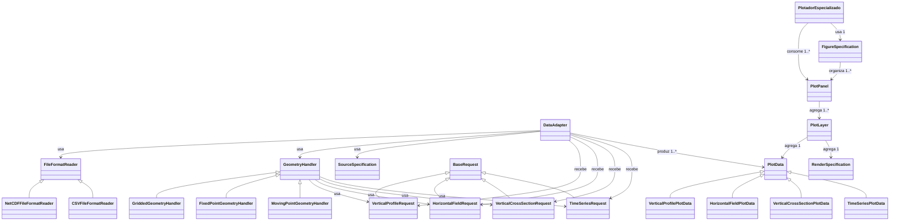

# DataAdapter

## Papel

`DataAdapter` e a classe orquestradora da preparacao de dados.

Ela combina:

- um `FileFormatReader`;
- um `GeometryHandler`;
- uma `SourceSpecification`.

Seu papel nao e concentrar toda a logica em uma classe monolitica, mas montar
as pecas necessarias para preparar a fonte.

Na API publica, a ideia e que o usuario precise instanciar apenas o
`DataAdapter`, informando parametros de alto nivel como:

- referencia da fonte (`path` ou `glob_pattern`);
- formato de arquivo;
- tipo de geometria;
- `SourceSpecification`.

A partir desses parametros, o proprio `DataAdapter` deve resolver e instanciar
internamente:

- o `FileFormatReader` concreto adequado;
- o `GeometryHandler` concreto adequado.

Essa decisao simplifica o uso da arquitetura sem perder modularidade interna.

## Diagrama de relacao entre classes

Leitura correta desse diagrama:

- `SourceSpecification` entra no `DataAdapter` como especificacao de leitura e
  interpretacao da fonte;
- os objetos de request entram no `DataAdapter` para definir o recorte
  concreto de cada saida;
- `SourceSpecification` nao acompanha obrigatoriamente a `PlotData`;
- cada `PlotLayer` associa uma `PlotData` a uma `RenderSpecification`;
- cada `PlotPanel` agrupa as `PlotLayer`s de um subplot;
- `FigureSpecification` organiza como os paineis serao distribuidos na figura.

## `DataAdapter` vs `PlotData`

Esta distincao precisa ficar explicita:

- `DataAdapter` = componente/classe que prepara o dado;
- `PlotData` = estrutura que carrega o dado pronto para plot.

Tambem precisamos separar duas dimensoes diferentes:

- `FileFormatReader` e orientado ao tipo de entrada/origem/formato;
- `GeometryHandler` e orientado a estrutura espacial da fonte;
- `SourceSpecification` e orientada ao significado das variaveis, coordenadas e
  unidades;
- `DataAdapter` compoe essas pecas;
- `PlotData` e orientada ao tipo geometrico do plot.

## O que o `DataAdapter` faz

O `DataAdapter` recebe configuracoes de alto nivel da fonte e executa tarefas
como:

- usar um `FileFormatReader` para abrir e normalizar a fonte;
- usar um `GeometryHandler` para interpretar a estrutura espacial;
- aplicar uma `SourceSpecification`;
- selecionar ponto;
- escolher datas;
- fazer media temporal;
- converter unidade;
- calcular variavel derivada;
- organizar eixos.

Ao final, o `DataAdapter` devolve uma ou mais `PlotData`.

Regra operacional:

- o `GeometryHandler` aplica o recorte espacial e temporal quando necessario;
- o `DataAdapter`, como classe master, realiza o restante do preparo para
  empurrar o dado pronto para plot.

## Regra de arquitetura

Os `DataAdapter`s nao precisam proliferar por instrumento ou por produto.
O importante e que sejam montados a partir de pecas menores e reutilizaveis.

Regra pratica importante:

- o `DataAdapter` deve ser pensado como um adapter por fonte;
- um mesmo `DataAdapter` pode produzir varias `PlotData` da mesma fonte, por
  exemplo uma por variavel de um painel multi-variavel;
- nao e desejavel criar um `DataAdapter` diferente para cada variavel quando a
  fonte e a mesma.

Exemplos:

- modelo em grade:
  - `NetCDFFileFormatReader`
  - `GriddedGeometryHandler`
  - `ModelSourceSpecification`
- radiossonda em netCDF:
  - `NetCDFFileFormatReader`
  - `MovingPointGeometryHandler`
  - `PointObservationSourceSpecification`
- estacao de superficie em CSV:
  - `CSVFileFormatReader`
  - `FixedPointGeometryHandler`
  - `PointObservationSourceSpecification`
- ceilometer em netCDF ou CSV:
  - `NetCDFFileFormatReader` ou `CSVFileFormatReader`
  - `FixedPointGeometryHandler`
  - `PointObservationSourceSpecification`
