# DataAdapter

## Papel

`DataAdapter` e a classe orquestradora da preparacao de dados.

Ela combina:

- um `FileFormatReader`;
- um `GeometryHandler`;
- uma `SourceSpecification`.

Seu papel nao e concentrar toda a logica em uma classe monolitica, mas montar
as pecas necessarias para preparar a fonte.

Na API publica, a ideia e que o usuario precise instanciar apenas o
`DataAdapter`, informando parametros de alto nivel como:

- referencia da fonte (`path` ou `glob_pattern`);
- formato de arquivo;
- tipo de geometria;
- `SourceSpecification`.

A partir desses parametros, o proprio `DataAdapter` deve resolver e instanciar
internamente:

- o `FileFormatReader` concreto adequado;
- o `GeometryHandler` concreto adequado.

Essa decisao simplifica o uso da arquitetura sem perder modularidade interna.

## Assinatura publica sugerida

Uma assinatura publica coerente com as decisoes ja tomadas e:

```python
@dataclass
class DataAdapter:
    path: str | Path | None = None
    glob_pattern: str | None = None
    file_format: Literal["netcdf", "csv"]
    geometry_type: Literal["gridded", "fixed_point", "moving_point"]
    source_specification: SourceSpecification
    reader_options: Mapping[str, Any] | None = None
```

Campos publicos:

- `path`
  - referencia a um arquivo unico;
- `glob_pattern`
  - referencia a um conjunto de arquivos por wildcard;
- `file_format`
  - indica qual `FileFormatReader` concreto deve ser resolvido;
- `geometry_type`
  - indica qual `GeometryHandler` concreto deve ser resolvido;
- `source_specification`
  - define nomes de coordenadas, variaveis, unidades e derivacoes;
  - pode omitir nomes de coordenadas quando eles puderem ser inferidos de
    forma segura;
- `reader_options`
  - concentra opcoes especificas do reader, sem poluir a assinatura principal;
  - deve funcionar como um conjunto de chaves e valores que preenchem os
    parametros adicionais do metodo de backend responsavel pela leitura.

Leitura correta de `reader_options`:

- para `netcdf`, `reader_options` deve ser repassado para os parametros
  adicionais do metodo efetivamente usado:
  - `xarray.open_dataset`, quando a fonte vier por `path`;
  - `xarray.open_mfdataset`, quando a fonte vier por `glob_pattern`;
- para `csv`, `reader_options` deve ser repassado para os parametros
  adicionais de `pandas.read_csv`.

Exemplos:

- `netcdf`
  - `engine`
  - `chunks`
  - `combine`
  - `concat_dim`
  - `preprocess`

- `csv`
  - `sep`
  - `encoding`
  - `decimal`
  - `parse_dates`

Regras de validacao esperadas:

- exatamente um entre `path` e `glob_pattern` deve ser informado;
- `glob_pattern` deve ser suportado apenas para fontes `netcdf`;
- para `csv`, apenas `path` deve ser aceito no MVP;
- para `csv`, o caso prioritario desta arquitetura e `geometry_type="fixed_point"`;
- para `netcdf`, o backend de abertura deve ser escolhido assim:
  - `path` -> `xarray.open_dataset`
  - `glob_pattern` -> `xarray.open_mfdataset`
- `file_format` e `geometry_type` devem ser suficientes para resolver os
  componentes concretos internamente;
- `source_specification` e obrigatoria.

## Metodos publicos sugeridos

```python
def open_data(self) -> xr.Dataset: ...

def to_vertical_profile_plot_data(
    self,
    *,
    variable_name: str,
    request: VerticalProfileRequest,
) -> VerticalProfilePlotData: ...

def to_horizontal_field_plot_data(
    self,
    *,
    variable_name: str,
    request: HorizontalFieldRequest,
) -> HorizontalFieldPlotData: ...

def to_vertical_cross_section_plot_data(
    self,
    *,
    variable_name: str,
    request: VerticalCrossSectionRequest,
) -> VerticalCrossSectionPlotData: ...

def to_time_series_plot_data(
    self,
    *,
    variable_name: str,
    request: TimeSeriesRequest,
) -> TimeSeriesPlotData: ...

def to_time_vertical_section_plot_data(
    self,
    *,
    variable_name: str,
    request: TimeVerticalSectionRequest,
) -> TimeVerticalSectionPlotData: ...
```

Observacao importante:

- `variable_name` deve ser sempre o nome canonico interno da variavel, por
  exemplo `theta`, `rh`, `tke` ou `sensible_heat_flux`;
- o nome real da variavel na fonte continua sendo resolvido pela
  `SourceSpecification`;
- a validacao de `variable_name` deve consultar a lista simples de nomes
  canonicos mantida no modulo dedicado do codigo, por exemplo
  `plot_core/canonical_variables.py`;
- cada chamada publica deve produzir exatamente uma `PlotData` do tipo
  solicitado;
- quando o usuario quiser gerar um plot por tempo em produtos cujo tempo nao e
  eixo explicito do resultado, o loop temporal deve ficar fora do
  `DataAdapter`.

## Estado interno esperado

O estado interno pode incluir, sem expor isso como API principal:

- `_reader`
- `_geometry_handler`
- `_dataset`

Objetivo:

- manter a API publica simples;
- permitir reuso do `Dataset` ja aberto;
- evitar que o usuario precise instanciar manualmente readers e handlers.

Exemplos curtos de instanciacao:

```python
DataAdapter(
    path="/dados/monan/history_20140215.nc",
    file_format="netcdf",
    geometry_type="gridded",
    source_specification=monan_spec,
)
```

```python
DataAdapter(
    path="/dados/goamazon/radiosonde_20140215.nc",
    file_format="netcdf",
    geometry_type="moving_point",
    source_specification=radiosonde_spec,
)
```

## Diagrama de relacao entre classes

```mermaid
classDiagram
    class DataAdapter
    class FileFormatReader
    class NetCDFFileFormatReader
    class CSVFileFormatReader
    class GeometryHandler
    class GriddedGeometryHandler
    class FixedPointGeometryHandler
    class MovingPointGeometryHandler
    class SourceSpecification
    class BaseRequest
    class VerticalProfileRequest
    class HorizontalFieldRequest
    class VerticalCrossSectionRequest
    class TimeSeriesRequest
    class TimeVerticalSectionRequest
    class RenderSpecification
    class PlotLayer
    class PlotPanel
    class FigureSpecification
    class VerticalProfilePlotData
    class HorizontalFieldPlotData
    class VerticalCrossSectionPlotData
    class TimeSeriesPlotData
    class TimeVerticalSectionPlotData
    class SpecializedPlotter

    FileFormatReader <|-- NetCDFFileFormatReader
    FileFormatReader <|-- CSVFileFormatReader

    GeometryHandler <|-- GriddedGeometryHandler
    GeometryHandler <|-- FixedPointGeometryHandler
    GeometryHandler <|-- MovingPointGeometryHandler

    BaseRequest <|-- VerticalProfileRequest
    BaseRequest <|-- HorizontalFieldRequest
    BaseRequest <|-- VerticalCrossSectionRequest
    BaseRequest <|-- TimeSeriesRequest
    BaseRequest <|-- TimeVerticalSectionRequest

    DataAdapter --> FileFormatReader : usa
    DataAdapter --> GeometryHandler : usa
    DataAdapter --> SourceSpecification : usa
    DataAdapter --> VerticalProfileRequest : recebe
    DataAdapter --> HorizontalFieldRequest : recebe
    DataAdapter --> VerticalCrossSectionRequest : recebe
    DataAdapter --> TimeSeriesRequest : recebe
    DataAdapter --> TimeVerticalSectionRequest : recebe
    DataAdapter --> VerticalProfilePlotData : produz 0..*
    DataAdapter --> HorizontalFieldPlotData : produz 0..*
    DataAdapter --> VerticalCrossSectionPlotData : produz 0..*
    DataAdapter --> TimeSeriesPlotData : produz 0..*
    DataAdapter --> TimeVerticalSectionPlotData : produz 0..*

    GeometryHandler --> VerticalProfileRequest : usa
    GeometryHandler --> HorizontalFieldRequest : usa
    GeometryHandler --> VerticalCrossSectionRequest : usa
    GeometryHandler --> TimeSeriesRequest : usa
    GeometryHandler --> TimeVerticalSectionRequest : usa

    PlotLayer --> VerticalProfilePlotData : agrega 0..1
    PlotLayer --> HorizontalFieldPlotData : agrega 0..1
    PlotLayer --> VerticalCrossSectionPlotData : agrega 0..1
    PlotLayer --> TimeSeriesPlotData : agrega 0..1
    PlotLayer --> TimeVerticalSectionPlotData : agrega 0..1
    PlotLayer --> RenderSpecification : agrega 1
    PlotPanel --> PlotLayer : agrega 1..*
    SpecializedPlotter --> PlotPanel : consome 1..*
    SpecializedPlotter --> FigureSpecification : usa 1
```



Leitura correta desse diagrama:

- na implementacao inicial, nao e necessario criar uma classe base concreta
  `PlotData`;
- o `DataAdapter` produz diretamente instancias das dataclasses concretas de
  plot;
- `SourceSpecification` entra no `DataAdapter` como especificacao de leitura e
  interpretacao da fonte;
- os objetos de request entram no `DataAdapter` para definir o recorte
  concreto de cada saida;
- `SourceSpecification` nao acompanha obrigatoriamente a `PlotData`;
- cada `PlotLayer` associa uma `PlotData` a uma `RenderSpecification`;
- cada `PlotPanel` agrupa as `PlotLayer`s de um subplot;
- `FigureSpecification` descreve a figura, mas nao agrega os paineis;
- o `SpecializedPlotter` recebe separadamente:
  - os `PlotPanel`s;
  - a `FigureSpecification`.

## `DataAdapter` vs `PlotData`

Esta distincao precisa ficar explicita:

- `DataAdapter` = componente/classe que prepara o dado;
- `PlotData` = estrutura que carrega o dado pronto para plot.

Tambem precisamos separar duas dimensoes diferentes:

- `FileFormatReader` e orientado ao tipo de entrada/origem/formato;
- `GeometryHandler` e orientado a estrutura espacial da fonte;
- `SourceSpecification` e orientada ao significado das variaveis, coordenadas e
  unidades;
- `DataAdapter` compoe essas pecas;
- `PlotData` e orientada ao tipo geometrico do plot.

## O que o `DataAdapter` faz

O `DataAdapter` recebe configuracoes de alto nivel da fonte e executa tarefas
como:

- usar um `FileFormatReader` apenas para abrir o dado em disco e converter para
  `xarray.Dataset`;
- usar um `GeometryHandler` para interpretar a estrutura espacial;
- aplicar uma `SourceSpecification`;
- resolver nomes de coordenadas explicitamente informados ou inferi-los por
  fallback quando necessario;
- resolver variaveis diretamente por `source_name` quando elas existirem na
  fonte;
- quando `input_units` nao estiver explicita, tentar recuperar a unidade a
  partir de `attrs["units"]` da variavel aberta;
- quando houver `derivation_kind`, consultar um registry interno de derivacoes
  fechadas para descobrir a funcao de derivacao e suas dependencias canonicas;
- definir, para cada chamada publica, o subconjunto de variaveis canonicas
  necessario para o preparo daquela saida;
- repassar esse subconjunto ao `GeometryHandler` como
  `required_variable_names`;
- esse subconjunto deve incluir as dependencias canonicas de derivacao
  necessarias para a chamada atual, e nao apenas o nome canonico final pedido
  pelo usuario;
- nessa primeira versao, esse registry pode ser apenas um dicionario simples,
  sem a necessidade de uma classe `DerivationSpecification`;
- preferir funcoes oficiais de `metpy.calc` no registry de derivacoes, quando
  elas existirem;
- garantir que as entradas de derivacao estejam com unidades compativeis antes
  de chamar o MetPy;
- quando `derivation_options` estiver presente, repassar esses parametros para
  a funcao de derivacao correspondente;
- padronizar internamente as coordenadas para:
  - `latitude`
  - `longitude`
  - `time`
  - `vertical`

Exemplos curtos de `derivation_options`:

- `{"lapse_rate": 0.0065}`
- `{"saturation_formula": "bolton"}`

Exemplos de funcoes do MetPy que o registry pode usar:

- `metpy.calc.potential_temperature`
- `metpy.calc.relative_humidity_from_mixing_ratio`
- `metpy.calc.pressure_to_height_std`
- `metpy.calc.height_to_pressure_std`
- selecionar ponto;
- escolher datas;
- fazer media temporal;
- converter unidade;
- calcular variavel derivada;
- organizar eixos.

Ao final de cada chamada publica, o `DataAdapter` devolve uma `PlotData`.

Regra operacional:

- o `GeometryHandler` aplica o recorte espacial e temporal quando necessario;
- o `DataAdapter`, como classe master, realiza o restante do preparo para
  empurrar o dado pronto para plot.

Regra de inferencia de coordenadas:

- primeiro, o `DataAdapter` deve respeitar nomes explicitamente informados em
  `SourceSpecification`;
- se algum nome nao vier explicitado, o sistema pode inferir por fallback;
- em caso de ambiguidade, o processo deve falhar com erro explicito;
- os nomes internos canonicos da arquitetura sao:
  - `latitude`
  - `longitude`
  - `time`
  - `vertical`

## Regra de arquitetura

Os `DataAdapter`s nao precisam proliferar por instrumento ou por produto.
O importante e que sejam montados a partir de pecas menores e reutilizaveis.

Regra pratica importante:

- o `DataAdapter` deve ser pensado como um adapter por fonte;
- um mesmo `DataAdapter` pode produzir varias `PlotData` da mesma fonte, por
  exemplo uma por variavel de um painel multi-variavel;
- nao e desejavel criar um `DataAdapter` diferente para cada variavel quando a
  fonte e a mesma.

Exemplos:

- modelo em grade:
  - `NetCDFFileFormatReader`
  - `GriddedGeometryHandler`
  - `SourceSpecification`
- radiossonda em netCDF:
  - `NetCDFFileFormatReader`
  - `MovingPointGeometryHandler`
  - `SourceSpecification`
- estacao de superficie em CSV:
  - `CSVFileFormatReader`
  - `FixedPointGeometryHandler`
  - `SourceSpecification`
- ceilometer em netCDF ou CSV:
  - `NetCDFFileFormatReader` ou `CSVFileFormatReader`
  - `FixedPointGeometryHandler`
  - `SourceSpecification`
