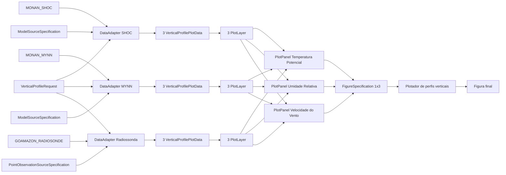

# Exemplos

## Relacao entre componentes

Fluxo proposto:

1. Um `DataAdapter` recebe parametros de alto nivel, como formato do arquivo,
   tipo de geometria, referencia da fonte e uma `SourceSpecification`.
2. A partir desses parametros, o proprio `DataAdapter` resolve e instancia
   internamente o `FileFormatReader` e o `GeometryHandler` concretos.
3. O `DataAdapter` usa essas pecas para ler, interpretar e preparar os dados.
4. O `DataAdapter` devolve uma ou mais instancias de `VerticalProfilePlotData`,
   `HorizontalFieldPlotData`, `VerticalCrossSectionPlotData` ou
   `TimeSeriesPlotData`.
5. Cada `PlotData` e associada a uma `RenderSpecification`, formando uma
   `PlotLayer`.
6. Uma ou mais `PlotLayer`s sao agrupadas em `PlotPanel`s.
7. O metodo de plot recebe os `PlotPanel`s e uma `FigureSpecification`.
8. O plotador renderiza a figura sem conhecer a origem dos dados.

## Perfil vertical de modelo e radiossonda

1. um `DataAdapter` configurado com `file_format="netcdf"`,
   `geometry_type="gridded"` e `ModelSourceSpecification` produz uma
   `VerticalProfilePlotData`;
2. outro `DataAdapter` configurado com `file_format="netcdf"`,
   `geometry_type="moving_point"` e `PointObservationSourceSpecification`
   produz outra `VerticalProfilePlotData`;
3. as duas `PlotLayer`s sao agrupadas no mesmo `PlotPanel`;
4. o plotador de perfis recebe esse painel e a configuracao da figura.

## Mapa com superficie colorida e isolinhas

1. uma `HorizontalFieldPlotData` representa o campo da superficie;
2. outra `HorizontalFieldPlotData` representa o campo das isolinhas;
3. cada uma recebe sua propria `RenderSpecification`, formando duas
   `PlotLayer`s;
4. as duas camadas entram no mesmo `PlotPanel`;
5. o plotador horizontal compoe esse painel na figura final.

## Secao transversal vertical

1. um `DataAdapter` configurado com `file_format="netcdf"`,
   `geometry_type="gridded"` e `ModelSourceSpecification` recebe um
   `VerticalCrossSectionRequest`;
2. o `GriddedGeometryHandler` prepara o recorte ao longo do transecto
   horizontal, preservando o eixo vertical;
3. o `DataAdapter` monta uma `VerticalCrossSectionPlotData`;
4. uma ou mais `PlotLayer`s sao agrupadas em um `PlotPanel`;
5. o plotador especializado renderiza a secao com as camadas desejadas.

## Figura com quatro paineis de perfil vertical

1. para cada variavel, o `DataAdapter` produz uma `VerticalProfilePlotData`
   por fonte comparada, por exemplo modelo A, modelo B e observacao;
2. cada `VerticalProfilePlotData` recebe sua propria `RenderSpecification`,
   formando uma `PlotLayer`;
3. as camadas referentes a uma mesma variavel sao agrupadas em um
   `PlotPanel`;
4. os quatro `PlotPanel`s sao organizados em uma `FigureSpecification` 2x2;
5. o plotador especializado renderiza a figura final com todos os paineis.

Exemplo explicito:

- modelo A = 1 `DataAdapter`
- modelo B = 1 `DataAdapter`
- observacao = 1 `DataAdapter`

Nesse caso, cada painel pode conter tres `PlotLayer`s:

- uma gerada pelo `DataAdapter` do modelo A;
- uma gerada pelo `DataAdapter` do modelo B;
- uma gerada pelo `DataAdapter` da observacao.

## Exemplo concreto: `MONAN_SHOC` x `MONAN_MYNN` x `GOAMAZON_RADIOSONDE`

Suponha o seguinte objetivo:

- comparar perfis verticais de:
  - temperatura potencial;
  - umidade relativa;
  - velocidade do vento;
- usando tres fontes:
  - `MONAN_SHOC`
  - `MONAN_MYNN`
  - `GOAMAZON_RADIOSONDE`

Nesse caso, a organizacao na arquitetura fica assim:

### Fontes e adapters

- `MONAN_SHOC`
  - `DataAdapter` proprio da fonte
  - `file_format="netcdf"`
  - `geometry_type="gridded"`
  - `ModelSourceSpecification`

- `MONAN_MYNN`
  - `DataAdapter` proprio da fonte
  - `file_format="netcdf"`
  - `geometry_type="gridded"`
  - `ModelSourceSpecification`

- `GOAMAZON_RADIOSONDE`
  - `DataAdapter` proprio da fonte
  - `file_format="netcdf"`
  - `geometry_type="moving_point"`
  - `PointObservationSourceSpecification`

Resumo:

- existe um `DataAdapter` por fonte;
- nesse exemplo, teremos tres `DataAdapter`s;
- cada um deles pode produzir varias `PlotData`, uma para cada variavel
  solicitada.

### Request comum

Um `VerticalProfileRequest` pode ser reutilizado pelas tres fontes.

Exemplo conceitual:

- `times=[t0]`
- `vertical_axis="pressure"`
- `point_lat` e `point_lon` informados para as fontes gridded

Nesse caso:

- `MONAN_SHOC` e `MONAN_MYNN` usam `point_lat` e `point_lon` para selecionar o
  ponto mais proximo;
- `GOAMAZON_RADIOSONDE` usa o mesmo request, mas sem depender de selecao de
  ponto fixo, porque o perfil ja e movel por natureza.

### Comunicacao entre classes

Para cada fonte:

1. o `DataAdapter` recebe:
   - referencia da fonte;
   - tipo de arquivo;
   - tipo de geometria;
   - `SourceSpecification`;
   - `VerticalProfileRequest`.
2. o `DataAdapter` resolve internamente:
   - `NetCDFFileFormatReader`;
   - `GriddedGeometryHandler` ou `MovingPointGeometryHandler`.
3. o `FileFormatReader` abre e normaliza o dado em `xarray.Dataset`.
4. o `GeometryHandler`:
   - valida a geometria;
   - aplica o recorte espacial/temporal;
   - devolve um `Dataset` intermediario para perfil vertical.
5. o `DataAdapter`:
   - aplica a `SourceSpecification`;
   - extrai ou deriva:
     - temperatura potencial;
     - umidade relativa;
     - velocidade do vento;
   - monta tres `VerticalProfilePlotData`.

Ao final, teremos:

- `MONAN_SHOC` -> 3 `VerticalProfilePlotData`
- `MONAN_MYNN` -> 3 `VerticalProfilePlotData`
- `GOAMAZON_RADIOSONDE` -> 3 `VerticalProfilePlotData`

Total:

- 9 `VerticalProfilePlotData`

### Camadas, paineis e figura

Cada `VerticalProfilePlotData` recebe sua propria `RenderSpecification`,
formando uma `PlotLayer`.

Assim:

- painel de temperatura potencial
  - `PlotLayer` de `MONAN_SHOC`
  - `PlotLayer` de `MONAN_MYNN`
  - `PlotLayer` de `GOAMAZON_RADIOSONDE`

- painel de umidade relativa
  - `PlotLayer` de `MONAN_SHOC`
  - `PlotLayer` de `MONAN_MYNN`
  - `PlotLayer` de `GOAMAZON_RADIOSONDE`

- painel de velocidade do vento
  - `PlotLayer` de `MONAN_SHOC`
  - `PlotLayer` de `MONAN_MYNN`
  - `PlotLayer` de `GOAMAZON_RADIOSONDE`

Cada conjunto acima forma um `PlotPanel`.

Portanto:

- 3 `PlotPanel`s
- cada painel com 3 `PlotLayer`s

Por fim, uma `FigureSpecification` organiza esses paineis, por exemplo:

- `nrows=1`
- `ncols=3`
- `sharey=True`
- `suptitle="Perfis verticais comparados"`

### Fluxo resumido

### Leitura correta do exemplo

- a comparacao entre modelos e observacao nao exige um plotador diferente;
- o que muda entre as fontes e:
  - o `DataAdapter`;
  - a `SourceSpecification`;
  - o `GeometryHandler` resolvido internamente;
- a partir do momento em que todas as fontes geram `VerticalProfilePlotData`,
  elas passam a ser combinadas de forma homogenea;
- a composicao final da figura acontece por meio de:
  - `PlotLayer`
  - `PlotPanel`
  - `FigureSpecification`
