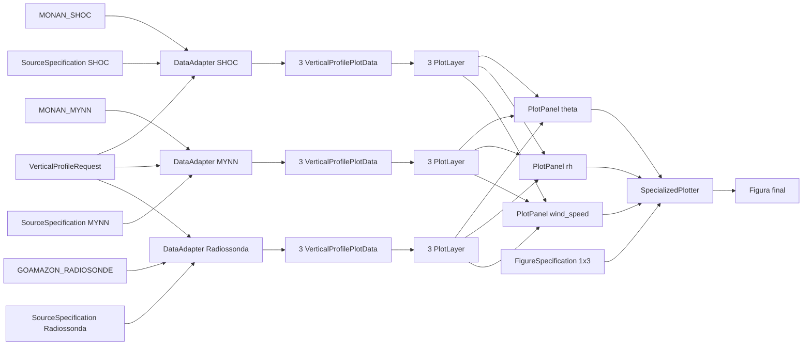
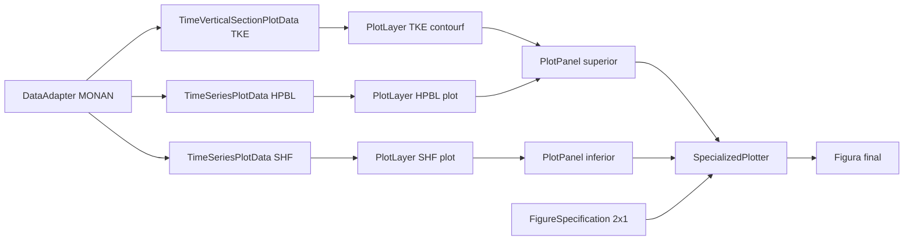

# Exemplos

## Relacao entre componentes

Fluxo proposto:

1. Um `DataAdapter` recebe parametros de alto nivel, como formato do arquivo,
   tipo de geometria, referencia da fonte e uma `SourceSpecification`.
2. A partir desses parametros, o proprio `DataAdapter` resolve e instancia
   internamente o `FileFormatReader` e o `GeometryHandler` concretos.
3. O `DataAdapter` usa essas pecas para ler, interpretar e preparar os dados.
4. O `DataAdapter` devolve uma instancia de `VerticalProfilePlotData`,
   `HorizontalFieldPlotData`, `VerticalCrossSectionPlotData`,
   `TimeSeriesPlotData` ou `TimeVerticalSectionPlotData` por chamada publica,
   por exemplo:
   - `to_vertical_profile_plot_data(variable_name=..., request=...)`;
   - `to_horizontal_field_plot_data(variable_name=..., request=...)`;
   - `to_vertical_cross_section_plot_data(variable_name=..., request=...)`;
   - `to_time_series_plot_data(variable_name=..., request=...)`;
   - `to_time_vertical_section_plot_data(variable_name=..., request=...)`.
5. Cada `PlotData` e associada a uma `RenderSpecification`, formando uma
   `PlotLayer`.
6. Uma ou mais `PlotLayer`s sao agrupadas em `PlotPanel`s.
7. O metodo de plot recebe os `PlotPanel`s e uma `FigureSpecification`.
8. O plotador renderiza a figura sem conhecer a origem dos dados.

## Perfil vertical de modelo e radiossonda

1. um `DataAdapter` configurado com `file_format="netcdf"`,
   `geometry_type="gridded"` e `SourceSpecification` produz uma
   `VerticalProfilePlotData`;
2. outro `DataAdapter` configurado com `file_format="netcdf"`,
   `geometry_type="moving_point"` e `SourceSpecification`
   produz outra `VerticalProfilePlotData`;
3. as duas `PlotLayer`s sao agrupadas no mesmo `PlotPanel`;
4. o `SpecializedPlotter` recebe esse painel e a configuracao da figura.

## Mapa com superficie colorida e isolinhas

1. uma `HorizontalFieldPlotData` representa o campo da superficie;
2. outra `HorizontalFieldPlotData` representa o campo das isolinhas;
3. cada uma recebe sua propria `RenderSpecification`, formando duas
   `PlotLayer`s;
4. as duas camadas entram no mesmo `PlotPanel`;
5. o `SpecializedPlotter` compoe esse painel na figura final.

## Secao transversal vertical

1. um `DataAdapter` configurado com `file_format="netcdf"`,
   `geometry_type="gridded"` e `SourceSpecification` recebe um
   `VerticalCrossSectionRequest`;
2. o `GriddedGeometryHandler` prepara o recorte ao longo do transecto
   horizontal, preservando o eixo vertical;
3. o `DataAdapter` monta uma `VerticalCrossSectionPlotData`;
4. uma ou mais `PlotLayer`s sao agrupadas em um `PlotPanel`;
5. o `SpecializedPlotter` renderiza a secao com as camadas desejadas.

## Figura com quatro paineis de perfil vertical

1. para cada variavel, o `DataAdapter` produz uma `VerticalProfilePlotData`
   por fonte comparada, por exemplo modelo A, modelo B e observacao;
2. cada `VerticalProfilePlotData` recebe sua propria `RenderSpecification`,
   formando uma `PlotLayer`;
3. as camadas referentes a uma mesma variavel sao agrupadas em um
   `PlotPanel`;
4. os quatro `PlotPanel`s sao enviados ao `SpecializedPlotter` junto com uma
   `FigureSpecification` 2x2;
5. o `SpecializedPlotter` renderiza a figura final com todos os paineis.

Exemplo explicito:

- modelo A = 1 `DataAdapter`
- modelo B = 1 `DataAdapter`
- observacao = 1 `DataAdapter`

Nesse caso, cada painel pode conter tres `PlotLayer`s:

- uma gerada pelo `DataAdapter` do modelo A;
- uma gerada pelo `DataAdapter` do modelo B;
- uma gerada pelo `DataAdapter` da observacao.

## Exemplo concreto: `MONAN_SHOC` x `MONAN_MYNN` x `GOAMAZON_RADIOSONDE`

Suponha o seguinte objetivo:

- comparar perfis verticais de:
  - `theta`;
  - `rh`;
  - `wind_speed`;
- usando tres fontes:
  - `MONAN_SHOC`
  - `MONAN_MYNN`
  - `GOAMAZON_RADIOSONDE`

Nesse caso, a organizacao na arquitetura fica assim:

### Fontes e adapters

- `MONAN_SHOC`
  - `DataAdapter` proprio da fonte
  - `file_format="netcdf"`
  - `geometry_type="gridded"`
  - `SourceSpecification`

- `MONAN_MYNN`
  - `DataAdapter` proprio da fonte
  - `file_format="netcdf"`
  - `geometry_type="gridded"`
  - `SourceSpecification`

- `GOAMAZON_RADIOSONDE`
  - `DataAdapter` proprio da fonte
  - `file_format="netcdf"`
  - `geometry_type="moving_point"`
  - `SourceSpecification`

Resumo:

- existe um `DataAdapter` por fonte;
- nesse exemplo, teremos tres `DataAdapter`s;
- cada um deles pode produzir varias `PlotData`, uma para cada variavel
  solicitada.

### Request comum

Um `VerticalProfileRequest` pode ser reutilizado pelas tres fontes.

Exemplo conceitual:

- `times=[t0]`
- `vertical_axis="pressure"`
- `point_lat` e `point_lon` informados para as fontes gridded

Nesse caso:

- `MONAN_SHOC` e `MONAN_MYNN` usam `point_lat` e `point_lon` para selecionar o
  ponto mais proximo;
- `GOAMAZON_RADIOSONDE` usa o mesmo request, mas sem depender de selecao de
  ponto fixo, porque o perfil ja e movel por natureza.

### Comunicacao entre classes

Para cada fonte:

1. o `DataAdapter` recebe:
   - referencia da fonte;
   - tipo de arquivo;
   - tipo de geometria;
   - `SourceSpecification`;
   - `VerticalProfileRequest`.
2. o `DataAdapter` resolve internamente:
   - `NetCDFFileFormatReader`;
   - `GriddedGeometryHandler` ou `MovingPointGeometryHandler`.
3. o `FileFormatReader` abre o dado em disco e o converte para
   `xarray.Dataset`.
4. o `GeometryHandler`:
   - valida a geometria;
   - aplica o recorte espacial/temporal;
   - devolve um `Dataset` intermediario para perfil vertical.
5. o `DataAdapter`:
   - aplica a `SourceSpecification`;
   - extrai ou deriva:
     - `theta`;
     - `rh`;
     - `wind_speed`;
   - monta tres `VerticalProfilePlotData`.

Ao final, teremos:

- `MONAN_SHOC` -> 3 `VerticalProfilePlotData`
- `MONAN_MYNN` -> 3 `VerticalProfilePlotData`
- `GOAMAZON_RADIOSONDE` -> 3 `VerticalProfilePlotData`

Total:

- 9 `VerticalProfilePlotData`

### Camadas, paineis e figura

Cada `VerticalProfilePlotData` recebe sua propria `RenderSpecification`,
formando uma `PlotLayer`.

Assim:

- painel de `theta`
  - `PlotLayer` de `MONAN_SHOC`
  - `PlotLayer` de `MONAN_MYNN`
  - `PlotLayer` de `GOAMAZON_RADIOSONDE`

- painel de `rh`
  - `PlotLayer` de `MONAN_SHOC`
  - `PlotLayer` de `MONAN_MYNN`
  - `PlotLayer` de `GOAMAZON_RADIOSONDE`

- painel de `wind_speed`
  - `PlotLayer` de `MONAN_SHOC`
  - `PlotLayer` de `MONAN_MYNN`
  - `PlotLayer` de `GOAMAZON_RADIOSONDE`

Cada conjunto acima forma um `PlotPanel`.

Portanto:

- 3 `PlotPanel`s
- cada painel com 3 `PlotLayer`s

Por fim, uma `FigureSpecification` descreve a figura que sera usada pelo
`SpecializedPlotter`, por exemplo:

- `nrows=1`
- `ncols=3`
- `suptitle="Perfis verticais comparados"`
- `subplot_kwargs={"sharey": True}`

### Fluxo resumido

### Leitura correta do exemplo

- cada `DataAdapter` continua encapsulando apenas a preparacao do dado de sua
  propria fonte;
- as comparacoes entre fontes aparecem no nivel de `PlotLayer` e `PlotPanel`,
  e nao dentro do adapter;
- o `SpecializedPlotter` recebe apenas a estrutura final de renderizacao.

## Exemplo concreto: `MONAN` com `TKE`, `HPBL` e `SHF`

Suponha o seguinte objetivo:

- usar um unico `DataAdapter` chamado `MONAN`;
- produzir uma figura com dois subplots;
- no painel superior, mostrar:
  - `TKE` como campo vertical x tempo medio em uma regiao;
  - `HPBL` como linha sobreposta, convertida para pressao equivalente;
- no painel inferior, mostrar:
  - `SHF` como serie temporal.

### `PlotData` geradas pelo `DataAdapter`

Para esse caso, um unico `DataAdapter` da fonte `MONAN` produz:

1. `to_time_vertical_section_plot_data(variable_name="tke", request=...)`
   - devolve uma `TimeVerticalSectionPlotData`;
   - essa `PlotData` representa a evolucao temporal vertical media de `TKE`
     em uma regiao.
2. `to_time_series_plot_data(variable_name="hpbl", request=...)`
   - devolve uma `TimeSeriesPlotData`;
   - essa `PlotData` representa a serie temporal de `HPBL`, ja preparada para
     ser desenhada como linha no mesmo painel do `TKE`.
3. `to_time_series_plot_data(variable_name="sensible_heat_flux", request=...)`
   - devolve outra `TimeSeriesPlotData`;
   - essa `PlotData` representa a serie temporal de `SHF`.

Resumo:

- `TKE` -> `TimeVerticalSectionPlotData`
- `HPBL` -> `TimeSeriesPlotData`
- `SHF` -> `TimeSeriesPlotData`

### `PlotLayer`s

As `PlotData` acima viram tres camadas:

- camada 1
  - `PlotData`: `TimeVerticalSectionPlotData` de `TKE`
  - `RenderSpecification`: `artist_method="contourf"` ou `pcolormesh`
- camada 2
  - `PlotData`: `TimeSeriesPlotData` de `HPBL`
  - `RenderSpecification`: `artist_method="plot"`
- camada 3
  - `PlotData`: `TimeSeriesPlotData` de `SHF`
  - `RenderSpecification`: `artist_method="plot"`

### `PlotPanel`s

Os `PlotLayer`s se organizam assim:

- painel superior
  - camada de `TKE`
  - camada de `HPBL`
- painel inferior
  - camada de `SHF`

Isso deixa claro dois comportamentos importantes da arquitetura:

- diferentes `PlotLayer`s podem ser sobrepostos no mesmo `PlotPanel`;
- nem todo painel precisa ter mais de uma camada.

### `FigureSpecification` e `SpecializedPlotter`

Esse caso pode ser desenhado com:

- `FigureSpecification`
  - `nrows=2`
  - `ncols=1`
- `SpecializedPlotter`
  - recebe os dois `PlotPanel`s;
  - aplica a configuracao global da figura;
  - desenha o painel superior com sobreposicao de `TKE` e `HPBL`;
  - desenha o painel inferior com `SHF`.

### Fluxo resumido

### Leitura correta desse caso

- um unico `DataAdapter` pode produzir `PlotData` de tipos diferentes para a
  mesma fonte;
- `TKE`, `HPBL` e `SHF` nao exigem adapters separados;
- a composicao da figura acontece apenas depois, via `PlotLayer`,
  `PlotPanel` e `FigureSpecification`;
- o `SpecializedPlotter` nao precisa conhecer a origem `MONAN`, apenas os
  contratos de `PlotData` e renderizacao.
