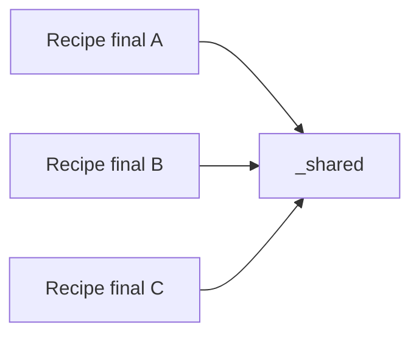

# Helpers Compartilhados de Recipes

Este documento explica o papel de `plot_core/recipes/_shared/` na
arquitetura atual.

O objetivo e permitir reuso entre recipes finais sem criar acoplamento
direto entre elas.

## Objetivo

`plot_core/recipes/_shared/` existe para concentrar logica reutilizavel
entre recipes finais.

Exemplos tipicos:

- montagem de diferenca entre dois campos;
- calculo de limites compartilhados de colorbar;
- regras de rotulagem matricial;
- reducoes diurnas reutilizadas por mais de um recipe.

## Regra arquitetural

A regra do projeto e:

- recipes finais podem depender de modulos em
  `plot_core/recipes/_shared/`;
- recipes finais nao devem importar helpers privados umas das outras;
- quando uma logica passa a ser usada por mais de um recipe final, ela deve
  ser candidata a extracao para `_shared/`.

Em outras palavras:

- `plot_core/recipes/maps.py` pode usar `_shared/`;
- `plot_core/recipes/diurnal.py` pode usar `_shared/`;
- `plot_core/recipes/diurnal.py` nao deve depender de helper privado de
  `maps.py`.

## O que entra em `_shared/`

Entra em `_shared/`:

- logica reutilizavel por duas ou mais recipes finais;
- primitivas estaveis;
- funcoes sem identidade de plot final propria;
- contratos auxiliares que fazem sentido em mais de um recipe.

Nao entra em `_shared/`:

- wrappers finais de plots;
- defaults de cenarios concretos;
- paths, adapters e requests oficiais de um experimento;
- scripts batch;
- regras que so fazem sentido para um unico recipe.

## Modulos atuais

### `comparison_matrix.py`

Responsabilidade:

- logica compartilhada para figuras comparativas do tipo
  `left / right / delta`;
- diferenca entre campos;
- limites compartilhados e limites simetricos;
- rotulos matriciais de coluna e linha.

Hoje esse modulo concentra, por exemplo:

- `apply_comparison_matrix_labels(...)`
- `build_absolute_render_specification(...)`
- `build_difference_render_specification(...)`
- `build_difference_plot_data(...)`
- `format_units_label(...)`
- `validate_horizontal_field_compatibility(...)`

### `diurnal_reductions.py`

Responsabilidade:

- logica compartilhada de reducoes diurnas;
- amplitude diaria;
- fase de pico diaria;
- construcao de campos derivados do ciclo diurno.

Hoje esse modulo concentra, por exemplo:

- `resolve_diurnal_reduced_plot_data(...)`
- `DiurnalSourceInput`
- `resolve_diurnal_amplitude_plot_data(...)`
- `resolve_diurnal_peak_phase_plot_data(...)`
- `build_phase_difference_plot_data(...)`

## Fluxo de dependencia recomendado



Fluxo nao recomendado:


## Como decidir entre helper local e helper compartilhado

Use helper local quando:

- a logica ainda pertence claramente a um unico recipe;
- o nome do helper depende muito da semantica desse plot;
- nao ha um segundo consumidor real ainda.

Use `_shared/` quando:

- a mesma logica apareceu em duas ou mais recipes finais;
- o comportamento e generico o suficiente para ter identidade propria;
- voce quer evitar divergencia entre implementacoes paralelas.

## Protocolo seguro ao alterar `_shared/`

Quando um helper compartilhado for alterado:

1. localizar todos os consumidores;
2. revisar se a mudanca e compativel com cada recipe;
3. alinhar os recipes consumidores conscientemente;
4. rerodar validacoes minimas dos recipes afetados;
5. atualizar a documentacao, se a semantica mudou.

Comandos uteis:

```bash
rg "_shared/comparison_matrix|_shared.diurnal_reductions" plot_core/recipes
rg "nome_do_helper" plot_core/recipes
```

## Checklist antes de criar um helper em `_shared/`

- ele ja aparece em mais de um recipe final?
- ele tem nome generico e papel claro?
- ele nao depende de defaults de um cenario concreto?
- ele nao e um recipe final disfarçado?
- a documentacao do projeto continua clara depois da extracao?

Se a resposta for "nao" para a maioria desses pontos, o helper provavelmente
deve continuar local por enquanto.
