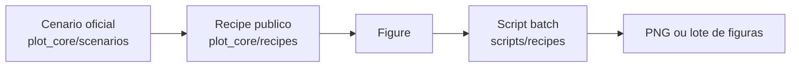
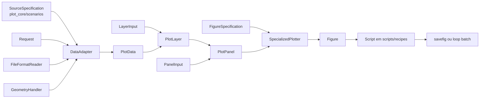

# Como criar um recipe novo

Este documento ensina a criar um recipe novo na arquitetura atual do
`plot_core`.

O foco aqui nao e apenas "em qual diretorio colocar o arquivo", mas sim:

- quais estruturas entram em cada camada;
- como elas se comunicam;
- o que deve ficar em `plot_core/`, `plot_core/scenarios/` e
  `scripts/recipes/`;
- como manter a extensibilidade por `layer`, que era uma constraint explicita
  do projeto.

## Objetivo de um recipe

Um recipe e a camada que orquestra um caso de uso concreto do projeto.

Ele fica entre:

- o nucleo generico do `plot_core`;
- e um plot real, como:
  - perfil vertical;
  - mapa comparativo;
  - secao vertical;
  - amplitude ou fase diaria.

Em termos práticos, um recipe:

- recebe entradas declarativas;
- usa `DataAdapter` para resolver `PlotData`;
- transforma isso em `PlotLayer` e `PlotPanel`;
- chama o `SpecializedPlotter`;
- devolve uma `Figure`.

## Onde cada coisa deve ser criada

### 1. `plot_core/recipes/`

Aqui fica o recipe publico e reutilizavel.

Exemplos:

- `plot_core/recipes/profiles.py`
- `plot_core/recipes/maps.py`
- `plot_core/recipes/cross_sections.py`
- `plot_core/recipes/diurnal.py`

O que deve entrar aqui:

- dataclasses de entrada do recipe;
- helpers privados do recipe;
- funcao publica `plot_...(...)`;
- wrappers publicos de casos legados, quando fizer sentido.

O que nao deve entrar aqui:

- paths concretos do projeto;
- glob patterns oficiais;
- configuracao especifica de uma campanha ou experimento;
- loops batch de salvamento de figuras;
- leitura manual com `xarray`.

### 2. `plot_core/scenarios/`

Aqui ficam os cenarios oficiais concretos do projeto.

Exemplos:

- `source_specifications.py`
- `adapters.py`
- `requests.py`
- `recipes.py`

O que deve entrar aqui:

- `SourceSpecification`s reais;
- `DataAdapter`s reais;
- `Request`s reais;
- builders oficiais que montam figuras, paineis ou inputs para recipes.

Em outras palavras:

- `plot_core/recipes/` define "como o tipo de plot funciona";
- `plot_core/scenarios/` define "como o projeto usa esse recipe no mundo
  real".

### 3. `scripts/recipes/`

Aqui ficam os entrypoints oficiais executaveis.

O que deve entrar aqui:

- scripts batch;
- loops temporais ou espaciais;
- chamada de `savefig`;
- criacao e fechamento explicito de adapters reutilizados.

## Fluxo visual de alto nivel



## Fluxo visual completo



## Regra principal de design

O recipe deve crescer por composicao.

Isso significa:

- adicionar uma nova `layer` deve significar adicionar um novo item em uma
  lista;
- adicionar um novo `panel` deve significar adicionar um novo item em uma
  lista;
- a assinatura publica nao deve crescer com `primary_`, `secondary_`,
  `tertiary_` e variantes.

Essa constraint continua oficial no projeto.

## Passo a passo recomendado

## Passo 1. Escolha a geometria do dado

Antes de escrever qualquer linha, defina qual `PlotData` representa o caso.

Exemplos:

- perfil vertical:
  - `VerticalProfilePlotData`
- mapa:
  - `HorizontalFieldPlotData`
- secao vertical:
  - `VerticalCrossSectionPlotData`
- serie temporal:
  - `TimeSeriesPlotData`
- tempo x vertical:
  - `TimeVerticalSectionPlotData`

Essa decisao define:

- qual `Request` usar;
- qual `adapter.to_*_plot_data(...)` chamar;
- quais artists do `matplotlib` fazem sentido;
- qual tipo de `LayerInput` criar.

## Passo 2. Crie os `*LayerInput` e `*PanelInput`

O recipe deve expor dataclasses simples e objetivas.

Exemplo estrutural:

```python
@dataclass
class ExampleLayerInput:
    adapter: DataAdapter
    request: HorizontalFieldRequest
    variable_name: str
    render_specification: RenderSpecification
    legend_label: str | None = None


@dataclass
class ExamplePanelInput:
    layers: Sequence[ExampleLayerInput]
    axes_set_kwargs: dict[str, Any] = field(default_factory=dict)
    legend_kwargs: dict[str, Any] | None = None
    axes_calls: list[dict[str, Any]] = field(default_factory=list)
```

Objetivo dessas estruturas:

- `LayerInput`
  - descrever uma camada compativel com o tipo do plot;
- `PanelInput`
  - agrupar varias camadas no mesmo subplot.

## Passo 3. Implemente a funcao publica `plot_...(...)`

Ela deve:

1. validar entradas;
2. resolver cada layer por adapter;
3. converter para `PlotLayer`;
4. agrupar em `PlotPanel`;
5. chamar `SpecializedPlotter.plot(...)`.

Esqueleto minimo:

```python
def plot_example_panels(
    *,
    panels: Sequence[ExamplePanelInput],
    figure_specification: FigureSpecification,
    plotter: SpecializedPlotter | None = None,
) -> Figure:
    if not panels:
        raise ValueError("At least one panel is required.")

    resolved_panels = [
        _build_example_plot_panel(panel_input)
        for panel_input in panels
    ]
    recipe_plotter = plotter or SpecializedPlotter()
    return recipe_plotter.plot(
        panels=resolved_panels,
        figure_specification=figure_specification,
    )
```

## Passo 4. Separe helpers privados pequenos

Normalmente o modulo do recipe precisa de helpers como:

- `_build_plot_layer(...)`
- `_build_plot_panel(...)`
- `_resolve_plot_data(...)`
- `_apply_shared_limits(...)`

Esses helpers devem:

- ficar no mesmo modulo do recipe;
- usar prefixo `_`;
- ficar abaixo da API publica;
- nao ser exportados no `__init__.py`.

## Passo 5. Use o `DataAdapter` corretamente

O recipe nao deve abrir arquivo diretamente.

Ele deve chamar apenas os metodos do adapter.

Exemplos:

- `adapter.to_vertical_profile_plot_data(...)`
- `adapter.to_horizontal_field_plot_data(...)`
- `adapter.to_vertical_cross_section_plot_data(...)`
- `adapter.to_time_series_plot_data(...)`
- `adapter.to_time_vertical_section_plot_data(...)`

Responsabilidades separadas:

- `FileFormatReader`
  - le do disco;
- `GeometryHandler`
  - faz a interpretacao geometrica;
- `SourceSpecification`
  - resolve nomes e unidades;
- `DataAdapter`
  - orquestra tudo isso;
- recipe
  - apenas compoe o caso de uso.

## Passo 6. So crie wrapper legado quando fizer sentido

Em varios casos, vale ter dois niveis:

1. um recipe generico e flexivel;
2. um wrapper legado de conveniencia.

Exemplo de leitura correta:

- `plot_map_panels(...)`
  - recipe generico;
- `plot_paper_grade_panel(...)`
  - wrapper legado apoiado nesse recipe generico.

Isso e importante porque:

- preserva o caso legado;
- sem prender a arquitetura inteira a ele.

## Passo 7. Promova o uso real para `plot_core/scenarios/`

Depois do recipe publico pronto, o proximo passo e criar o cenario oficial.

Normalmente isso significa escrever builders em:

- `plot_core/scenarios/source_specifications.py`
- `plot_core/scenarios/adapters.py`
- `plot_core/scenarios/requests.py`
- `plot_core/scenarios/recipes.py`

Exemplos de builders:

- `build_legacy_monan_e3sm_adapter()`
- `build_legacy_e3sm_adapter()`
- `build_legacy_monan_e3sm_hourly_mean_inputs()`
- `build_legacy_monan_precipitation_figure()`

## Passo 8. Crie o script oficial em `scripts/recipes/`

O script oficial deve:

- consumir `plot_core/scenarios`;
- montar loops temporais ou espaciais;
- salvar as figuras;
- reutilizar `DataAdapter`s ao longo do loop;
- chamar `adapter.close()` ao final.

Padrao esperado:

```python
monan_adapter = build_legacy_monan_adapter()
e3sm_adapter = build_legacy_e3sm_adapter()

try:
    for time in times:
        figure = build_some_figure(
            time=time,
            monan_adapter=monan_adapter,
            e3sm_adapter=e3sm_adapter,
        )
        figure.savefig(...)
finally:
    monan_adapter.close()
    e3sm_adapter.close()
```

## Passo 9. Documente o recipe

Cada recipe publico deve ganhar um markdown proprio em:

- `docs/c4/plot-core/recipes/`

Esse markdown deve ter:

- objetivo do recipe;
- placeholder de imagem;
- fluxo visual de alto nivel;
- fluxo visual completo;
- secao "Como adicionar mais uma layer";
- exemplo minimo de chamada.

## Onde cada estrutura entra

Resumo objetivo:

- `SourceSpecification`
  - descreve nomes, unidades e coordenadas da fonte;
- `Request`
  - descreve o recorte geometrico, vertical e temporal;
- `DataAdapter`
  - usa reader + geometry + specification para produzir `PlotData`;
- `RenderSpecification`
  - descreve como desenhar o dado;
- `LayerInput`
  - junta adapter + request + variavel + render;
- `PlotLayer`
  - resultado renderizavel de uma layer resolvida;
- `PanelInput`
  - agrupa varias layers do mesmo subplot;
- `PlotPanel`
  - estrutura final de subplot pronta para o plotter;
- `FigureSpecification`
  - layout global da figura;
- `SpecializedPlotter`
  - transforma `PlotPanel`s em `Figure`.

## Como adicionar mais uma layer

A forma correta e quase sempre esta:

1. escolha uma layer compativel com a geometria do plot;
2. crie mais um `*LayerInput`;
3. adicione esse item em `panel.layers`.

Exemplo conceitual:

```python
panel = MapPanelInput(
    layers=[
        MapLayerInput(..., variable_name="hpbl", ...),
        MapLayerInput(..., variable_name="another_field", ...),
    ],
)
```

Compatibilidade semantica continua valendo:

- recipe de mapa:
  - aceita layers de `HorizontalFieldPlotData`;
- recipe de perfil:
  - aceita layers de `VerticalProfilePlotData`;
- recipe de secao:
  - aceita layers de `VerticalCrossSectionPlotData`.

## O que evitar

Evite estes sinais de arquitetura errada:

- recipe abrindo dataset com `xarray` diretamente;
- paths concretos hardcoded dentro do recipe publico;
- loop batch dentro de `plot_core/recipes/`;
- assinatura publica crescendo por fonte ou por variavel;
- mistura de geometrias incompatíveis no mesmo recipe;
- regra cientifica especifica de um experimento sendo tratada como regra
  generica do core.

## Checklist final

Antes de considerar um recipe pronto, confira:

- existe dataclass de `LayerInput`;
- existe dataclass de `PanelInput`;
- a funcao publica `plot_...(...)` retorna `Figure`;
- o recipe usa apenas `DataAdapter` para resolver `PlotData`;
- limites compartilhados foram considerados em comparacoes justas;
- a extensibilidade por `layer` continua simples;
- existe builder oficial em `plot_core/scenarios/`;
- existe script oficial em `scripts/recipes/`;
- existe markdown proprio do recipe;
- o loop batch reutiliza adapters e chama `close()`.
