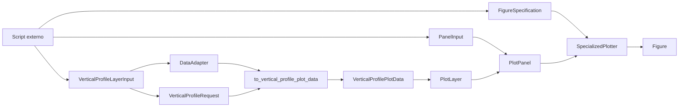
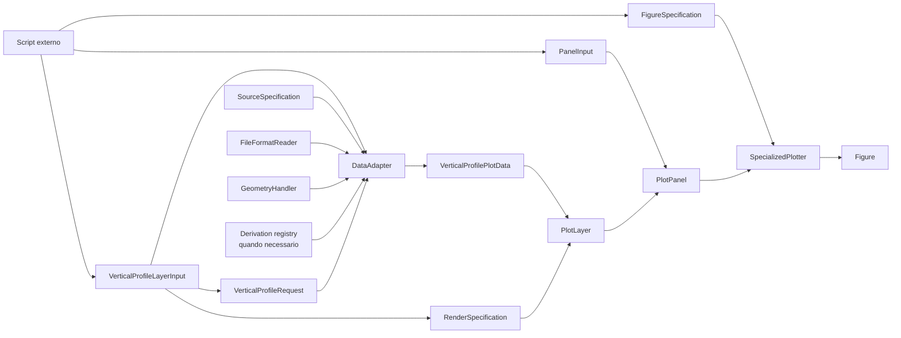

# Recipe: `plot_vertical_profiles_panel`

## Objetivo

Montar uma figura com um ou mais paineis de perfil vertical, com uma ou mais
curvas por painel.

## Imagem de referencia

Atualizar este link para uma imagem real:

- [vertical_profiles_panel.png](
  ../../../../tests/output/PLACEHOLDER_vertical_profiles_panel.png
  )

## Classes principais

- `VerticalProfileLayerInput`
- `PanelInput`
- `DataAdapter`
- `VerticalProfileRequest`
- `VerticalProfilePlotData`
- `PlotLayer`
- `PlotPanel`
- `FigureSpecification`
- `SpecializedPlotter`

## Fluxo visual de alto nivel



## Fluxo visual completo



## Exemplo minimo

```python
from plot_core.recipes import (
    PanelInput,
    VerticalProfileLayerInput,
    plot_vertical_profiles_panel,
)
from plot_core.rendering import FigureSpecification, RenderSpecification

figure = plot_vertical_profiles_panel(
    panels=[
        PanelInput(
            layers=[
                VerticalProfileLayerInput(
                    adapter=model_adapter,
                    request=model_request,
                    variable_name="u_wind",
                    render_specification=RenderSpecification(
                        artist_method="plot",
                        artist_kwargs={"color": "tab:blue"},
                    ),
                    legend_label="MONAN",
                ),
                VerticalProfileLayerInput(
                    adapter=obs_adapter,
                    request=obs_request,
                    variable_name="u_wind",
                    render_specification=RenderSpecification(
                        artist_method="plot",
                        artist_kwargs={"color": "black"},
                    ),
                    legend_label="OBS",
                ),
            ],
            axes_set_kwargs={
                "title": "U wind",
                "xlabel": "u (m s-1)",
                "ylabel": "Pressure (Pa)",
            },
        )
    ],
    figure_specification=FigureSpecification(
        nrows=1,
        ncols=1,
        figure_kwargs={"figsize": (6, 8)},
    ),
)
```

## Como adicionar mais uma layer

Essa era uma constraint do projeto: o usuario deve conseguir adicionar uma
nova layer sem inflar a assinatura do recipe.

Neste recipe, a alteracao acontece dentro de `PanelInput.layers`.

Regras:

- adicionar mais um `VerticalProfileLayerInput` na lista;
- manter `request.vertical_axis` compativel entre as layers do mesmo painel;
- usar uma `variable_name` que faca sentido como perfil vertical;
- ajustar `legend_label` e `render_specification` conforme necessario.

Exemplo:

```python
panels[0].layers.append(
    VerticalProfileLayerInput(
        adapter=second_model_adapter,
        request=second_model_request,
        variable_name="u_wind",
        render_specification=RenderSpecification(
            artist_method="plot",
            artist_kwargs={"color": "tab:orange"},
        ),
        legend_label="SECOND MODEL",
    )
)
```

O que nao faz sentido aqui:

- adicionar `MapLayerInput`;
- adicionar `CrossSectionLayerInput`;
- misturar perfis com eixos verticais semanticos diferentes no mesmo painel.
