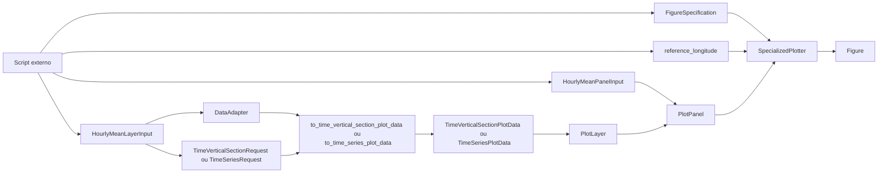
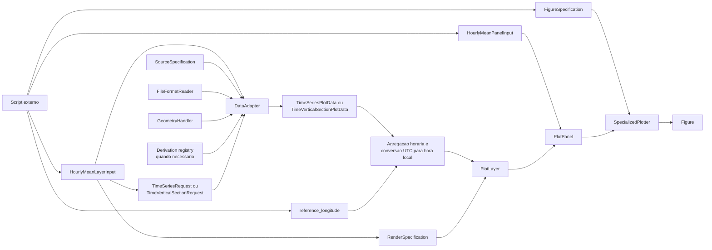

# Recipe: `plot_hourly_mean_panels`

## Objetivo

Montar paineis genericos de media horaria combinando camadas
`time_vertical` e `time_series`.

## Imagem de referencia

Atualizar este link para uma imagem real:

- [hourly_mean_panels.png](
  ../../../../tests/output/PLACEHOLDER_hourly_mean_panels.png
  )

## Classes principais

- `HourlyMeanLayerInput`
- `HourlyMeanPanelInput`
- `DataAdapter`
- `TimeVerticalSectionRequest`
- `TimeSeriesRequest`
- `TimeVerticalSectionPlotData`
- `TimeSeriesPlotData`
- `PlotLayer`
- `PlotPanel`
- `FigureSpecification`
- `SpecializedPlotter`

## Fluxo visual de alto nivel



## Fluxo visual completo



## Exemplo minimo

```python
from plot_core.recipes import (
    HourlyMeanLayerInput,
    HourlyMeanPanelInput,
    plot_hourly_mean_panels,
)
from plot_core.rendering import FigureSpecification, RenderSpecification

figure = plot_hourly_mean_panels(
    panels=[
        HourlyMeanPanelInput(
            layers=[
                HourlyMeanLayerInput(
                    adapter=model_adapter,
                    request=time_vertical_request,
                    variable_name="u_wind",
                    data_kind="time_vertical",
                    render_specification=RenderSpecification(
                        artist_method="pcolormesh",
                        artist_kwargs={"cmap": "viridis"},
                    ),
                )
            ],
            axes_set_kwargs={
                "title": "Hourly mean",
                "xlabel": "Local hour",
                "ylabel": "Pressure [hPa]",
            },
        )
    ],
    figure_specification=FigureSpecification(
        nrows=1,
        ncols=1,
        figure_kwargs={"figsize": (10, 5)},
    ),
    reference_longitude=0.0,
)
```

## Como adicionar mais uma layer

Esse recipe foi desenhado para crescer por lista de `HourlyMeanLayerInput`,
nao por novos parametros na funcao.

Neste caso, a alteracao tambem acontece em `HourlyMeanPanelInput.layers`.

Regras:

- adicionar mais um `HourlyMeanLayerInput` na lista;
- respeitar a semantica do painel:
- paineis `time x pressure` normalmente usam `data_kind="time_vertical"`;
- sobreposicoes como `hpbl` usam `data_kind="time_series"` e, quando
  necessario, `convert_height_to_pressure=True`;
- paineis inferiores de serie temporal usam layers `time_series`.

Exemplo de nova isolinha em um painel superior:

```python
panels[0].layers.append(
    HourlyMeanLayerInput(
        adapter=model_adapter,
        request=time_vertical_request,
        variable_name="qc",
        data_kind="time_vertical",
        render_specification=RenderSpecification(
            artist_method="contour",
            artist_kwargs={"colors": "white"},
        ),
        minimum_contour_level=1e-5,
    )
)
```

O que nao faz sentido aqui:

- adicionar um `HorizontalFieldRequest` ou um `MapLayerInput`;
- colocar uma serie temporal simples em um painel de secao sem conversao
  coerente para o eixo vertical.
