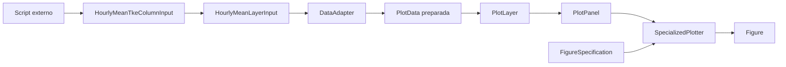
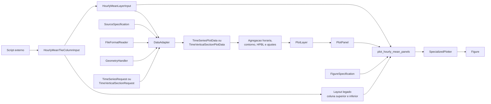

# Recipe: `plot_vertical_profile_tke_hourly_mean`

## Objetivo

Oferecer um wrapper de conveniencia para o layout legado de comparacao de
media horaria de TKE.

## Imagem de referencia

Atualizar este link para uma imagem real:

- [legacy_tke_hourly_mean.png](
  ../../../../tests/output/PLACEHOLDER_legacy_tke_hourly_mean.png
  )

## Classes principais

- `HourlyMeanTkeColumnInput`
- `HourlyMeanLayerInput`
- `DataAdapter`
- `PlotLayer`
- `PlotPanel`
- `FigureSpecification`
- `SpecializedPlotter`

## Fluxo visual de alto nivel



## Fluxo visual completo



## Observacao

Este recipe e mais especifico do que `plot_hourly_mean_panels`. Ele existe
para facilitar a migracao do layout legado, mas continua apoiado nas mesmas
pecas centrais do core.

## Como adicionar mais uma layer

Aqui existe uma distincao importante:

- este wrapper e conveniente para reproduzir o layout legado;
- a superficie mais flexivel para crescer com novas layers continua sendo
  `plot_hourly_mean_panels`.

Se a layer nova couber nos encaixes do wrapper, o ajuste e pequeno:

- `qc_layer` adiciona uma layer de contorno no painel superior;
- `hpbl_layer` adiciona uma serie temporal convertida para pressao no
  painel superior.

Se voce quiser uma layer arbitraria adicional alem desses encaixes, a
recomendacao e:

- migrar a chamada para `plot_hourly_mean_panels`;
- montar explicitamente `HourlyMeanPanelInput.layers`.

Exemplo conceitual:

```python
figure = plot_hourly_mean_panels(
    panels=[
        HourlyMeanPanelInput(
            layers=[
                tke_layer,
                qc_layer,
                hpbl_layer,
                extra_compatible_layer,
            ],
        ),
    ],
    figure_specification=figure_specification,
    reference_longitude=reference_longitude,
)
```

Resumo:

- para a migracao legada, use o wrapper;
- para extensao livre por layer, prefira o recipe generico.
