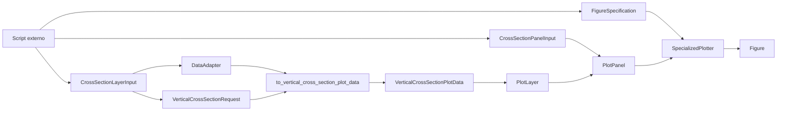
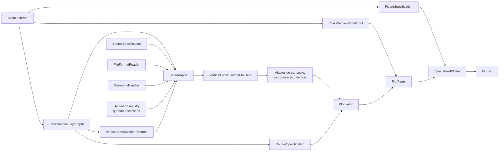

# Recipe: `plot_cross_section_panels`

## Objetivo

Montar paineis de secao vertical com campo sombreado e camadas adicionais,
como contornos e rotulos ao longo do transecto.

## Imagem de referencia

Atualizar este link para uma imagem real:

- [cross_section_panels.png](
  ../../../../tests/output/PLACEHOLDER_cross_section_panels.png
  )

## Classes principais

- `CrossSectionLayerInput`
- `CrossSectionPanelInput`
- `DataAdapter`
- `VerticalCrossSectionRequest`
- `VerticalCrossSectionPlotData`
- `PlotLayer`
- `PlotPanel`
- `FigureSpecification`
- `SpecializedPlotter`

## Fluxo visual de alto nivel



## Fluxo visual completo



## Exemplo minimo

```python
from plot_core.recipes import (
    CrossSectionLayerInput,
    CrossSectionPanelInput,
    plot_cross_section_panels,
)
from plot_core.rendering import FigureSpecification, RenderSpecification

figure = plot_cross_section_panels(
    panels=[
        CrossSectionPanelInput(
            layers=[
                CrossSectionLayerInput(
                    adapter=model_adapter,
                    request=transect_request,
                    variable_name="theta",
                    render_specification=RenderSpecification(
                        artist_method="pcolormesh",
                        artist_kwargs={"cmap": "viridis"},
                    ),
                    convert_pressure_to_hpa=True,
                )
            ],
            axes_set_kwargs={
                "title": "MONAN",
                "xlabel": "Coordinates along transect",
                "ylabel": "Pressure [hPa]",
            },
            transect_axis_mode="distance_km",
            use_coordinate_tick_labels=True,
        )
    ],
    figure_specification=FigureSpecification(
        nrows=1,
        ncols=1,
        figure_kwargs={"figsize": (12, 5)},
    ),
)
```

## Como adicionar mais uma layer

Essa extensibilidade tambem e uma constraint do recipe de secao vertical.

A alteracao acontece em `CrossSectionPanelInput.layers`.

Regras:

- adicionar mais um `CrossSectionLayerInput` na lista;
- manter o mesmo tipo de geometria de secao vertical;
- reutilizar um `VerticalCrossSectionRequest` compativel com o mesmo
  transecto;
- usar layers que facam sentido sobre o mesmo campo:
- campo sombreado;
- contorno;
- contorno com `clabel`;
- outra variavel no mesmo eixo vertical.

Exemplo:

```python
panels[0].layers.append(
    CrossSectionLayerInput(
        adapter=model_adapter,
        request=transect_request,
        variable_name="qc",
        render_specification=RenderSpecification(
            artist_method="contour",
            artist_kwargs={"colors": "white"},
        ),
        minimum_contour_level=1e-5,
        convert_pressure_to_hpa=True,
    )
)
```

O que nao faz sentido aqui:

- adicionar `MapLayerInput`;
- adicionar `VerticalProfileLayerInput`;
- misturar transectos diferentes dentro do mesmo painel sem tratar os eixos.
