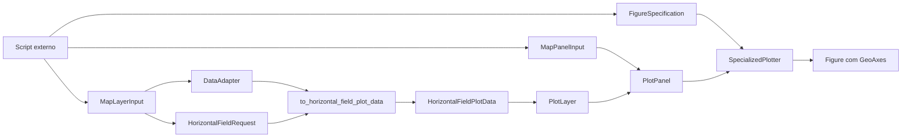
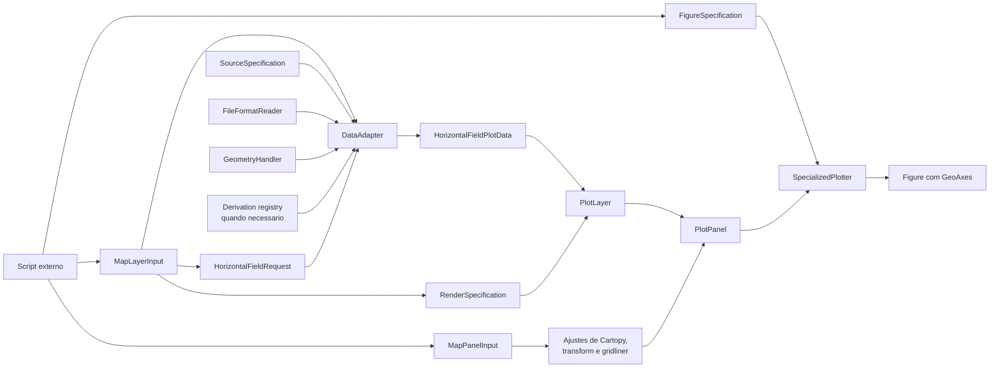

# Recipe: `plot_map_panels`

## Objetivo

Montar paineis de mapa com `cartopy`, incluindo coastlines, borders,
gridlines e colorbar compartilhada quando necessario.

## Imagem de referencia

Atualizar este link para uma imagem real:

- [map_panels.png](../../../../tests/output/PLACEHOLDER_map_panels.png)

## Classes principais

- `MapLayerInput`
- `MapPanelInput`
- `DataAdapter`
- `HorizontalFieldRequest`
- `HorizontalFieldPlotData`
- `PlotLayer`
- `PlotPanel`
- `FigureSpecification`
- `SpecializedPlotter`

## Fluxo visual de alto nivel



## Fluxo visual completo



## Exemplo minimo

```python
from plot_core.recipes import MapLayerInput, MapPanelInput, plot_map_panels
from plot_core.rendering import FigureSpecification, RenderSpecification

figure = plot_map_panels(
    panels=[
        MapPanelInput(
            layers=[
                MapLayerInput(
                    adapter=model_adapter,
                    request=field_request,
                    variable_name="hpbl",
                    render_specification=RenderSpecification(
                        artist_method="pcolormesh",
                        artist_kwargs={
                            "cmap": "turbo",
                            "vmin": 0.0,
                            "vmax": 3000.0,
                        },
                    ),
                )
            ],
            axes_set_kwargs={"title": "MONAN - HPBL"},
            coastlines_kwargs={"linewidth": 0.8},
            borders_kwargs={"linewidth": 0.5},
            gridlines_kwargs={"draw_labels": True},
        )
    ],
    figure_specification=FigureSpecification(
        nrows=1,
        ncols=1,
        figure_kwargs={"figsize": (10, 5)},
    ),
    share_main_field_limits=True,
)
```

## Como adicionar mais uma layer

Neste recipe, adicionar uma nova layer de mapa deve exigir poucas linhas.

A alteracao acontece em `MapPanelInput.layers`.

Voce pode adicionar:

- outro `MapLayerInput`, quando a layer ainda precisa ser resolvida pelo
  `DataAdapter`;
- ou um `PreparedMapLayerInput`, quando o `HorizontalFieldPlotData` ja foi
  preparado anteriormente.

Exemplo de contorno sobre um mapa sombreado:

```python
panels[0].layers.append(
    MapLayerInput(
        adapter=model_adapter,
        request=field_request,
        variable_name="surface_pressure",
        render_specification=RenderSpecification(
            artist_method="contour",
            artist_kwargs={"colors": "black", "linewidths": 0.8},
        ),
        legend_label="Surface pressure",
    )
)
```

O que nao faz sentido aqui:

- adicionar `VerticalProfileLayerInput`;
- adicionar `CrossSectionLayerInput`;
- misturar uma geometria que nao seja de campo horizontal georreferenciado.
