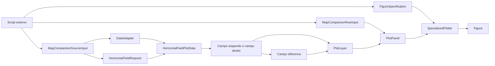
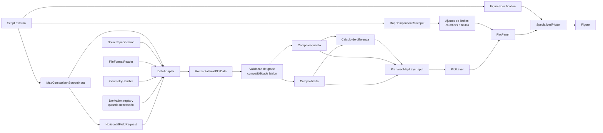

# Recipe: `plot_map_comparison_rows`

## Objetivo

Montar uma figura de comparacao por linhas, com tres colunas por linha:

- fonte da esquerda;
- fonte da direita;
- diferenca `esquerda - direita`.

## Imagem de referencia

Atualizar este link para uma imagem real:

- [map_comparison_rows.png](
  ../../../../tests/output/PLACEHOLDER_map_comparison_rows.png
  )

## Classes principais

- `MapComparisonSourceInput`
- `MapComparisonRowInput`
- `PreparedMapLayerInput`
- `HorizontalFieldRequest`
- `DataAdapter`
- `HorizontalFieldPlotData`
- `PlotLayer`
- `PlotPanel`
- `FigureSpecification`
- `SpecializedPlotter`

## Fluxo visual de alto nivel



## Fluxo visual completo



## Exemplo minimo

```python
from plot_core.recipes import (
    MapComparisonRowInput,
    MapComparisonSourceInput,
    plot_map_comparison_rows,
)
from plot_core.rendering import FigureSpecification, RenderSpecification

figure = plot_map_comparison_rows(
    rows=[
        MapComparisonRowInput(
            left_source=MapComparisonSourceInput(
                adapter=monan_adapter,
                request=request,
                variable_name="hpbl",
                source_label="MONAN",
            ),
            right_source=MapComparisonSourceInput(
                adapter=e3sm_adapter,
                request=request,
                variable_name="hpbl",
                source_label="E3SM",
            ),
            field_label="PBLH",
            absolute_render_specification=RenderSpecification(
                artist_method="pcolormesh",
                artist_kwargs={
                    "cmap": "turbo",
                    "vmin": 0.0,
                    "vmax": 3000.0,
                },
            ),
            difference_render_specification=RenderSpecification(
                artist_method="pcolormesh",
                artist_kwargs={
                    "cmap": "RdBu_r",
                    "vmin": -1500.0,
                    "vmax": 1500.0,
                },
            ),
            absolute_colorbar_label="PBLH",
            difference_colorbar_label="Delta PBLH",
        )
    ],
    figure_specification=FigureSpecification(
        nrows=1,
        ncols=3,
        figure_kwargs={"figsize": (18, 6)},
    ),
)
```

## Como adicionar mais uma layer

Este recipe e generico para comparacao em linhas, mas ele continua
organizado em torno de tres paineis por linha:

- campo da esquerda;
- campo da direita;
- diferenca.

Se a extensao desejada ainda couber nesse modelo, a recomendacao e:

- manter `plot_map_comparison_rows` para a estrutura da linha;
- preparar a nova layer como campo horizontal compativel;
- quando for necessario controle total por painel, descer um nivel e usar
  `plot_map_panels` com `MapPanelInput.layers` explicitos.

Em outras palavras:

- `plot_map_comparison_rows` e a API de comparacao por linha;
- `plot_map_panels` e a API mais livre para empilhar varias layers em cada
  mapa.

Exemplo de migracao para controle mais fino:

```python
left_panel = MapPanelInput(
    layers=[
        main_left_layer,
        extra_left_contour_layer,
    ],
)
```

O que nao faz sentido aqui:

- adicionar uma layer que nao seja um campo horizontal;
- tentar encaixar geometria de perfil ou secao vertical dentro da linha de
  comparacao de mapas.
