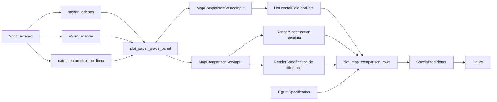

# Recipe: `plot_paper_grade_panel`

## Objetivo

Oferecer um wrapper de conveniencia para reproduzir o layout legado
`n_rows x 3` com:

- MONAN;
- E3SM;
- delta `MONAN - E3SM`.

## Imagem de referencia

Atualizar este link para uma imagem real:

- [paper_grade_panel.png](
  ../../../../tests/output/PLACEHOLDER_paper_grade_panel.png
  )

## Classes principais

- `DataAdapter`
- `MapComparisonSourceInput`
- `MapComparisonRowInput`
- `RenderSpecification`
- `FigureSpecification`
- `SpecializedPlotter`

## Fluxo visual de alto nivel


## Fluxo visual completo



## Observacao

Este recipe e especifico para a migracao do metodo legado
`plot_paper_grade_panel`, mas e construido sobre a API mais generica
`plot_map_comparison_rows`.

## Como adicionar mais uma layer

Vale a mesma ideia do wrapper legado de hourly mean:

- `plot_paper_grade_panel` existe para reproduzir o layout legado com
  rapidez;
- a superficie mais flexivel para adicionar layers continua sendo
  `plot_map_comparison_rows`;
- se voce precisar de controle total por painel, o nivel mais livre ainda e
  `plot_map_panels`.

Entao a orientacao pratica e:

- se a alteracao for de variavel, limite, cmap ou titulo por linha, o
  wrapper ainda faz sentido;
- se a alteracao for adicionar uma layer extra em um dos mapas, prefira
  migrar a chamada para `plot_map_comparison_rows` ou `plot_map_panels`.

Exemplo conceitual:

```python
figure = plot_map_comparison_rows(
    rows=[
        MapComparisonRowInput(
            left_source=...,
            right_source=...,
            field_label="PBLH",
            absolute_render_specification=...,
            difference_render_specification=...,
        )
    ],
    figure_specification=figure_specification,
)
```

Se ainda for necessario empilhar varias layers em cada mapa da linha, a
evolucao natural e sair do wrapper e montar `MapPanelInput.layers`
explicitamente com `plot_map_panels`.
