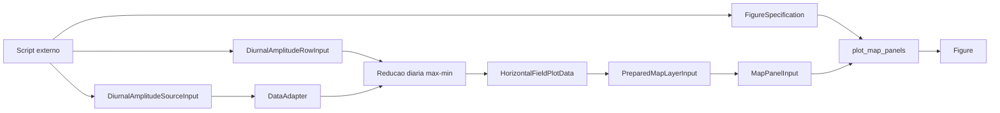
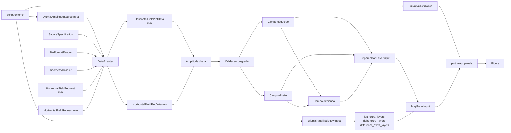

# Recipe: `plot_diurnal_amplitude_rows`

## Objetivo

Montar uma figura de comparacao diaria por linhas, com tres colunas por
linha:

- amplitude diaria da fonte da esquerda;
- amplitude diaria da fonte da direita;
- diferenca `esquerda - direita`.

## Imagem de referencia

Atualizar este link para uma imagem real:

- [diurnal_amplitude_rows.png](
  ../../../../tests/output/PLACEHOLDER_diurnal_amplitude_rows.png
  )

## Classes principais

- `DiurnalAmplitudeSourceInput`
- `DiurnalAmplitudeRowInput`
- `DataAdapter`
- `HorizontalFieldRequest`
- `HorizontalFieldPlotData`
- `PreparedMapLayerInput`
- `MapPanelInput`
- `FigureSpecification`
- `SpecializedPlotter`

## Fluxo visual de alto nivel



## Fluxo visual completo



## Exemplo minimo

```python
from plot_core.recipes import (
    DiurnalAmplitudeRowInput,
    DiurnalAmplitudeSourceInput,
    plot_diurnal_amplitude_rows,
)
from plot_core.rendering import FigureSpecification, RenderSpecification

figure = plot_diurnal_amplitude_rows(
    rows=[
        DiurnalAmplitudeRowInput(
            left_source=DiurnalAmplitudeSourceInput(
                adapter=monan_adapter,
                variable_name="hpbl",
                source_label="MONAN",
            ),
            right_source=DiurnalAmplitudeSourceInput(
                adapter=e3sm_adapter,
                variable_name="hpbl",
                source_label="E3SM",
            ),
            day_start=np.datetime64("2014-02-24"),
            field_label="Amplitude PBLH",
            absolute_render_specification=RenderSpecification(
                artist_method="pcolormesh",
                artist_kwargs={"cmap": "turbo", "vmin": 0.0},
            ),
            difference_render_specification=RenderSpecification(
                artist_method="pcolormesh",
                artist_kwargs={"cmap": "RdBu_r"},
            ),
        )
    ],
    figure_specification=FigureSpecification(
        nrows=1,
        ncols=3,
        figure_kwargs={"figsize": (18, 6)},
    ),
)
```

## Como adicionar mais uma layer

Esse recipe ja nasce com a constraint de extensibilidade em mente.

Se voce quiser sobrepor uma layer compativel a um painel especifico, a
alteracao acontece em:

- `left_extra_layers`;
- `right_extra_layers`;
- `difference_extra_layers`.

Essas layers extras devem continuar sendo camadas de mapa compativeis, por
exemplo:

- outro `MapLayerInput`;
- ou um `PreparedMapLayerInput`.

Exemplo de contorno extra sobre o painel da esquerda:

```python
row.left_extra_layers = [
    MapLayerInput(
        adapter=monan_adapter,
        request=single_time_request,
        variable_name="surface_pressure",
        render_specification=RenderSpecification(
            artist_method="contour",
            artist_kwargs={"colors": "black"},
        ),
    )
]
```

O que nao faz sentido aqui:

- adicionar `VerticalProfileLayerInput`;
- adicionar `CrossSectionLayerInput`;
- misturar uma geometria que nao seja horizontal georreferenciada.
