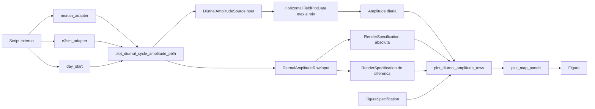

# Recipe: `plot_diurnal_cycle_amplitude_pblh`

## Objetivo

Oferecer um wrapper de conveniencia para reproduzir o layout legado de
amplitude diaria de `hpbl` entre MONAN e E3SM.

## Imagem de referencia

Atualizar este link para uma imagem real:

- [diurnal_cycle_amplitude_pblh.png](
  ../../../../tests/output/PLACEHOLDER_diurnal_cycle_amplitude_pblh.png
  )

## Classes principais

- `DataAdapter`
- `DiurnalAmplitudeSourceInput`
- `DiurnalAmplitudeRowInput`
- `RenderSpecification`
- `FigureSpecification`
- `SpecializedPlotter`

## Fluxo visual de alto nivel


## Fluxo visual completo



## Observacao

Este recipe e especifico para a migracao do metodo legado
`plot_diurnal_cycle_amplitude_pblh`, mas e construido sobre a API mais
generica `plot_diurnal_amplitude_rows`.

## Como adicionar mais uma layer

Vale a mesma logica dos outros wrappers legados:

- o wrapper existe para reproduzir o caso legado com rapidez;
- a superficie mais flexivel para adicionar layers continua sendo
  `plot_diurnal_amplitude_rows`.

Entao:

- se a alteracao for de colormap, limites ou variavel principal, o wrapper
  ainda faz sentido;
- se a alteracao for adicionar uma layer extra sobre MONAN, E3SM ou delta,
  prefira descer um nivel para `plot_diurnal_amplitude_rows`.

Exemplo conceitual:

```python
row = DiurnalAmplitudeRowInput(
    left_source=...,
    right_source=...,
    day_start=np.datetime64("2014-02-24"),
    field_label="Amplitude PBLH",
    absolute_render_specification=...,
    difference_render_specification=...,
    left_extra_layers=[extra_left_layer],
)
```

Resumo:

- para reproduzir o legado rapidamente, use o wrapper;
- para extensao livre por layer, prefira o recipe generico.
