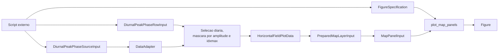
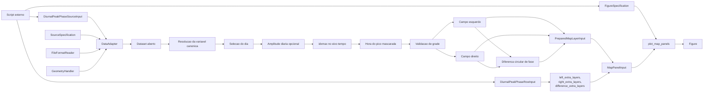

# Recipe: `plot_diurnal_peak_phase_rows`

## Objetivo

Montar uma figura de comparacao diaria por linhas, com tres colunas por
linha:

- fase do pico diario da fonte da esquerda;
- fase do pico diario da fonte da direita;
- diferenca de fase `esquerda - direita`.

Opcionalmente, o recipe pode mascarar pontos cuja amplitude diaria do
campo seja menor que um limiar, reduzindo ruido em areas onde a fase do
pico nao e robusta.

## Imagem de referencia

Atualizar este link para uma imagem real:

- [diurnal_peak_phase_rows.png](
  ../../../../tests/output/PLACEHOLDER_diurnal_peak_phase_rows.png
  )

## Classes principais

- `DiurnalPeakPhaseSourceInput`
- `DiurnalPeakPhaseRowInput`
- `DataAdapter`
- `HorizontalFieldPlotData`
- `PreparedMapLayerInput`
- `MapPanelInput`
- `FigureSpecification`
- `SpecializedPlotter`

## Fluxo visual de alto nivel



## Fluxo visual completo



## Exemplo minimo

```python
from plot_core.recipes import (
    DiurnalPeakPhaseRowInput,
    DiurnalPeakPhaseSourceInput,
    plot_diurnal_peak_phase_rows,
)
from plot_core.rendering import FigureSpecification, RenderSpecification

figure = plot_diurnal_peak_phase_rows(
    rows=[
        DiurnalPeakPhaseRowInput(
            left_source=DiurnalPeakPhaseSourceInput(
                adapter=monan_adapter,
                variable_name="hpbl",
                source_label="MONAN",
            ),
            right_source=DiurnalPeakPhaseSourceInput(
                adapter=e3sm_adapter,
                variable_name="hpbl",
                source_label="E3SM",
            ),
            day_start=np.datetime64("2014-02-24"),
            field_label="Peak Hour PBLH",
            minimum_amplitude_for_peak_phase=100.0,
            absolute_render_specification=RenderSpecification(
                artist_method="pcolormesh",
                artist_kwargs={
                    "cmap": "twilight",
                    "vmin": 0.0,
                    "vmax": 23.0,
                },
            ),
            difference_render_specification=RenderSpecification(
                artist_method="pcolormesh",
                artist_kwargs={
                    "cmap": "RdBu_r",
                    "vmin": -12.0,
                    "vmax": 12.0,
                },
            ),
        )
    ],
    figure_specification=FigureSpecification(
        nrows=1,
        ncols=3,
        figure_kwargs={"figsize": (18, 6)},
    ),
)
```

## Como adicionar mais uma layer

Esse recipe segue a mesma constraint de extensibilidade do restante do
projeto.

Se voce quiser sobrepor uma layer compativel a um painel especifico, a
alteracao acontece em:

- `left_extra_layers`;
- `right_extra_layers`;
- `difference_extra_layers`.

Essas layers extras devem continuar sendo camadas de mapa compativeis, por
exemplo:

- outro `MapLayerInput`;
- ou um `PreparedMapLayerInput`.

Exemplo de contorno extra sobre o painel da direita:

```python
row.right_extra_layers = [
    MapLayerInput(
        adapter=e3sm_adapter,
        request=single_time_request,
        variable_name="surface_pressure",
        render_specification=RenderSpecification(
            artist_method="contour",
            artist_kwargs={"colors": "black"},
        ),
    )
]
```

Para rodar sem o filtro de amplitude:

```python
row.minimum_amplitude_for_peak_phase = None
```

O que nao faz sentido aqui:

- adicionar `VerticalProfileLayerInput`;
- adicionar `CrossSectionLayerInput`;
- misturar uma geometria que nao seja horizontal georreferenciada.
