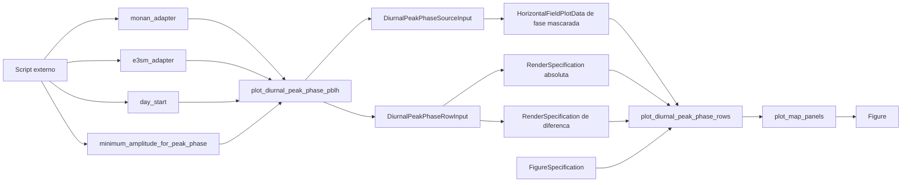

# Recipe: `plot_diurnal_peak_phase_pblh`

## Objetivo

Oferecer um wrapper de conveniencia para reproduzir o layout legado de fase
do pico diario de `hpbl` entre MONAN e E3SM.

Esse wrapper tambem aceita um limiar opcional de amplitude diaria para
mascarar pontos cuja fase do pico nao seja robusta.

## Imagem de referencia

Atualizar este link para uma imagem real:

- [diurnal_peak_phase_pblh.png](
  ../../../../tests/output/PLACEHOLDER_diurnal_peak_phase_pblh.png
  )

## Classes principais

- `DataAdapter`
- `DiurnalPeakPhaseSourceInput`
- `DiurnalPeakPhaseRowInput`
- `RenderSpecification`
- `FigureSpecification`
- `SpecializedPlotter`

## Fluxo visual de alto nivel


## Fluxo visual completo



## Observacao

Este recipe e especifico para a migracao do metodo legado
`plot_diurnal_peak_phase_pblh`, mas e construido sobre a API mais generica
`plot_diurnal_peak_phase_rows`.

## Como adicionar mais uma layer

Vale a mesma logica do wrapper legado de amplitude diaria:

- o wrapper existe para reproduzir o caso legado com rapidez;
- a superficie mais flexivel para adicionar layers continua sendo
  `plot_diurnal_peak_phase_rows`.
- o parametro `minimum_amplitude_for_peak_phase` permite rodar com filtro
  de ruido, por exemplo `100.0`, ou sem filtro, usando `None`.

Entao:

- se a alteracao for de colormap, limites ou variavel principal, o wrapper
  ainda faz sentido;
- se a alteracao for adicionar uma layer extra sobre MONAN, E3SM ou delta,
  prefira descer um nivel para `plot_diurnal_peak_phase_rows`.

Exemplo conceitual:

```python
row = DiurnalPeakPhaseRowInput(
    left_source=...,
    right_source=...,
    day_start=np.datetime64("2014-02-24"),
    field_label="Peak Hour PBLH",
    absolute_render_specification=...,
    difference_render_specification=...,
    right_extra_layers=[extra_right_layer],
)
```

Resumo:

- para reproduzir o legado rapidamente, use o wrapper;
- para ativar o filtro de amplitude, passe
  `minimum_amplitude_for_peak_phase=100.0`;
- para desativar o filtro, passe
  `minimum_amplitude_for_peak_phase=None`;
- para extensao livre por layer, prefira o recipe generico.
