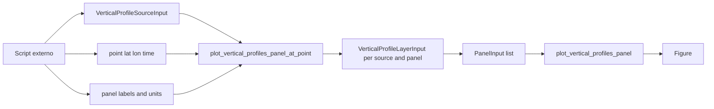
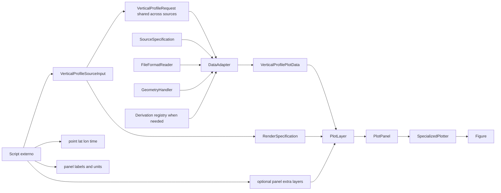

# Recipe: `plot_vertical_profiles_panel_at_point`

## Objetivo

Montar um painel de perfis verticais em um ponto geografico usando um
wrapper mais proximo do metodo legado, mas internamente apoiado no core
novo.

## Imagem de referencia

Atualizar este link para uma imagem real:

- [vertical_profiles_panel_at_point.png](
  ../../../../tests/output/PLACEHOLDER_vertical_profiles_panel_at_point.png
  )

## Classes principais

- `VerticalProfileSourceInput`
- `VerticalProfileLayerInput`
- `PanelInput`
- `DataAdapter`
- `VerticalProfileRequest`
- `FigureSpecification`
- `SpecializedPlotter`

## Fluxo visual de alto nivel



## Fluxo visual completo



## Exemplo minimo

```python
import numpy as np

from plot_core.recipes import (
    VerticalProfileSourceInput,
    plot_vertical_profiles_panel_at_point,
)
from plot_core.rendering import RenderSpecification

figure = plot_vertical_profiles_panel_at_point(
    sources=[
        VerticalProfileSourceInput(
            adapter=monan_adapter,
            variable_names=("theta", "tke_pbl", "qt", "wind_speed"),
            legend_label="MONAN - SHOC",
            render_specification=RenderSpecification(
                artist_method="plot",
                artist_kwargs={"color": "tab:blue", "linewidth": 2.0},
            ),
        ),
        VerticalProfileSourceInput(
            adapter=e3sm_adapter,
            variable_names=("theta", "tke_pbl", "qt", "wind_speed"),
            legend_label="E3SM",
            render_specification=RenderSpecification(
                artist_method="plot",
                artist_kwargs={"color": "tab:orange", "linewidth": 2.0},
            ),
        ),
    ],
    point_lat=-33.0,
    point_lon=288.0,
    time=np.datetime64("2014-02-24T00:00:00"),
    panel_labels=(
        "Potential Temperature",
        "TKE",
        "Total Water Mixing Ratio",
        "Wind Speed",
    ),
    x_units=("K", "m2 s-2", "kg kg-1", "m s-1"),
    vertical_axis="pressure",
    vertical_axis_label="Pressure [hPa]",
)
```

## Como adicionar mais uma layer

Sim, essa continua sendo uma constraint do projeto.

Neste wrapper ha dois caminhos naturais.

Adicionar mais uma fonte em todos os paineis:

- adicionar mais um `VerticalProfileSourceInput` em `sources`.

Adicionar uma layer extra apenas em um painel especifico:

- usar `panel_extra_layers`;
- inserir um `VerticalProfileLayerInput` na posicao do painel desejado.

Exemplo de layer extra apenas no primeiro painel:

```python
from plot_core.recipes import VerticalProfileLayerInput
from plot_core.rendering import RenderSpecification
from plot_core.requests import VerticalProfileRequest

panel_extra_layers = [
    [
        VerticalProfileLayerInput(
            adapter=third_adapter,
            request=VerticalProfileRequest(
                times=np.asarray(
                    ["2014-02-24T00:00:00"],
                    dtype="datetime64[ns]",
                ),
                vertical_axis="pressure",
                point_lat=-33.0,
                point_lon=288.0,
            ),
            variable_name="theta",
            render_specification=RenderSpecification(
                artist_method="plot",
                artist_kwargs={"color": "black", "linestyle": "--"},
            ),
            legend_label="THIRD SOURCE",
        )
    ],
    [],
    [],
    [],
]
```

O que faz sentido aqui:

- novas layers de perfil vertical;
- requests com o mesmo `vertical_axis` no mesmo painel;
- variaveis canonicas compativeis com perfil vertical.

O que nao faz sentido aqui:

- adicionar `MapLayerInput`;
- adicionar `CrossSectionLayerInput`;
- misturar semanticas verticais incompativeis no mesmo painel.
