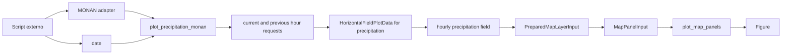
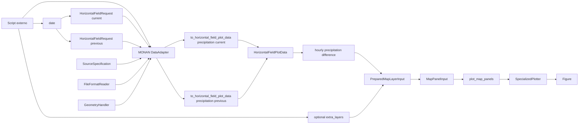

# Recipe: `plot_precipitation_monan`

## Objetivo

Montar um mapa horario de precipitacao do `MONAN`, derivando primeiro a
variavel acumulada `precipitation = rainc + rainnc` e deacumulando apenas
essa variavel entre o horario atual e o horario anterior.

## Imagem de referencia

Atualizar este link para uma imagem real:

- [precipitation_monan.png](
  ../../../../tests/output/PLACEHOLDER_precipitation_monan.png
  )

## Classes principais

- `DataAdapter`
- `HorizontalFieldRequest`
- `HorizontalFieldPlotData`
- `PreparedMapLayerInput`
- `MapPanelInput`
- `FigureSpecification`
- `SpecializedPlotter`

## Fluxo visual de alto nivel



## Fluxo visual completo



## Exemplo minimo

```python
import numpy as np

from plot_core.recipes import plot_precipitation_monan

figure = plot_precipitation_monan(
    monan_adapter=monan_adapter,
    date=np.datetime64("2014-02-24T01:00:00"),
)
```

## Como adicionar mais uma layer

Essa recipe tambem segue a constraint do projeto.

A extensao acontece por `extra_layers`.

Voce pode adicionar, por exemplo:

- contornos de outra variavel horizontal;
- outra camada `PreparedMapLayerInput` precomputada;
- qualquer layer compativel com `plot_map_panels`.

Exemplo de contorno sobre o sombreado de precipitacao:

```python
from plot_core.recipes import MapLayerInput
from plot_core.rendering import RenderSpecification
from plot_core.requests import HorizontalFieldRequest

figure = plot_precipitation_monan(
    monan_adapter=monan_adapter,
    date=np.datetime64("2014-02-24T01:00:00"),
    extra_layers=[
        MapLayerInput(
            adapter=monan_adapter,
            request=HorizontalFieldRequest(
                times=np.asarray(
                    ["2014-02-24T01:00:00"],
                    dtype="datetime64[ns]",
                ),
            ),
            variable_name="hpbl",
            render_specification=RenderSpecification(
                artist_method="contour",
                artist_kwargs={"colors": "black", "linewidths": 0.8},
            ),
            legend_label="HPBL",
        )
    ],
)
```

O que faz sentido aqui:

- novas layers de campo horizontal georreferenciado;
- overlays de contorno ou campo preparado;
- manter a compatibilidade com a mesma grade espacial.

O que nao faz sentido aqui:

- adicionar `VerticalProfileLayerInput`;
- adicionar `CrossSectionLayerInput`;
- misturar geometrias que nao sejam de mapa horizontal.
