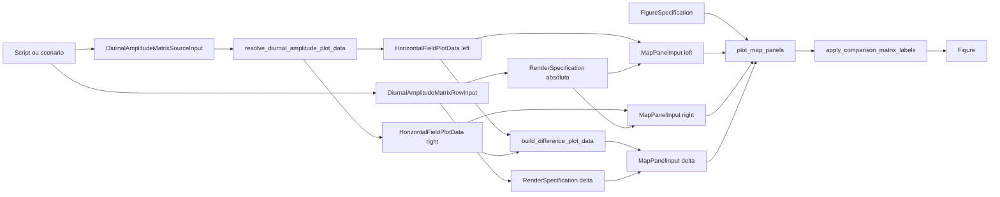

# Recipe: `plot_diurnal_amplitude_matrix_rows`

## Objetivo

Oferecer um recipe matricial `n x 3` para comparar amplitude diaria entre
duas fontes e o delta entre elas.

Cada linha representa uma variavel. Cada linha gera:

- coluna 1: fonte da esquerda;
- coluna 2: fonte da direita;
- coluna 3: diferenca `left - right`.

## Imagem de referencia

Atualizar este link para uma imagem real:

- [diurnal_amplitude_matrix_rows.png](
  ../../../../tests/output/PLACEHOLDER_diurnal_amplitude_matrix_rows.png
  )

## Classes principais

- `DataAdapter`
- `DiurnalAmplitudeMatrixSourceInput`
- `DiurnalAmplitudeMatrixRowInput`
- `RenderSpecification`
- `FigureSpecification`
- `SpecializedPlotter`

## Fluxo visual de alto nivel


## Fluxo visual completo



## Como adicionar mais uma layer

Esse recipe aceita expansao por painel sem inflar a assinatura publica.

Campos disponiveis por linha:

- `left_extra_layers`
- `right_extra_layers`
- `difference_extra_layers`

As layers extras precisam continuar sendo compativeis com mapa, por exemplo:

- `MapLayerInput`
- `PreparedMapLayerInput`

Exemplo:

```python
row = DiurnalAmplitudeMatrixRowInput(
    left_source=...,
    right_source=...,
    day_start=np.datetime64("2014-02-24"),
    field_label="Amplitude PBLH",
    absolute_render_specification=...,
    difference_render_specification=...,
    left_extra_layers=[extra_left_layer],
)
```

## Exemplo minimo

```python
figure = plot_diurnal_amplitude_matrix_rows(
    rows=[row_pblh, row_shf],
    figure_specification=FigureSpecification(
        nrows=2,
        ncols=3,
        suptitle="Diurnal-Cycle Amplitude Panel - 2014-02-24",
    ),
)
```
