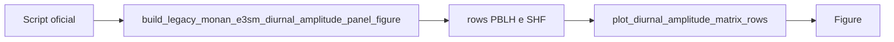
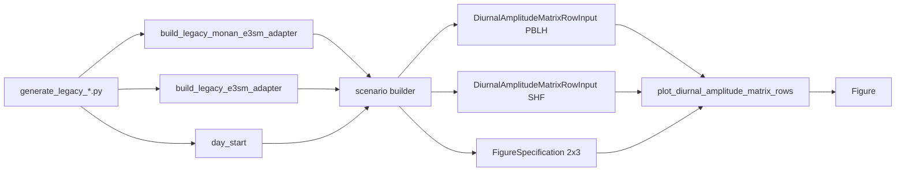

# Recipe: `build_legacy_monan_e3sm_diurnal_amplitude_panel_figure`

## Objetivo

Oferecer o cenario oficial `MONAN x E3SM` para uma figura `2 x 3` com:

- linha 1: amplitude diaria da `PBLH`;
- linha 2: amplitude diaria do `SHF`;
- coluna 1: `MONAN`;
- coluna 2: `E3SM`;
- coluna 3: `Delta (MONAN - E3SM)`.

## Imagem de referencia

Atualizar este link para uma imagem real:

- [diurnal_amplitude_panel_pblh_shf.png](
  ../../../../tests/output/PLACEHOLDER_diurnal_amplitude_panel_pblh_shf.png
  )

## Classes principais

- `DataAdapter`
- `DiurnalAmplitudeMatrixSourceInput`
- `DiurnalAmplitudeMatrixRowInput`
- `FigureSpecification`
- `plot_diurnal_amplitude_matrix_rows`

## Fluxo visual de alto nivel



## Fluxo visual completo



## Como adicionar mais uma layer

Para reproducao rapida do cenario oficial, use o builder pronto.

Se a necessidade for adicionar layers extras em um painel especifico, o
melhor caminho e descer um nivel para o recipe generico
`plot_diurnal_amplitude_matrix_rows`.

Exemplo conceitual:

```python
rows, figure_specification = (
    build_legacy_monan_e3sm_diurnal_amplitude_panel_inputs(...)
)
rows[0].left_extra_layers = [extra_layer]
figure = plot_diurnal_amplitude_matrix_rows(
    rows=rows,
    figure_specification=figure_specification,
)
```

## Observacao

Esse cenario combina:

- a semantica diurna de amplitude;
- a gramatica visual matricial do paper-grade;
- sem depender diretamente de helpers privados de outros recipes finais.
