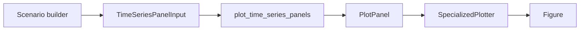
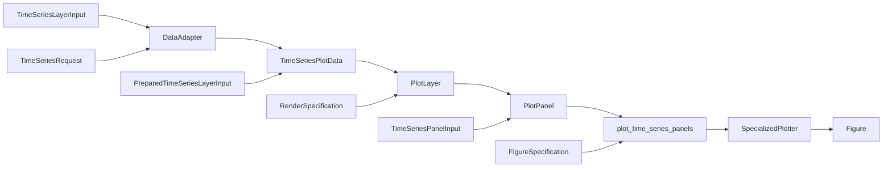

# Recipe: `plot_time_series_panels`

## Objetivo

Oferecer um recipe generico para compor uma figura com um ou mais paineis de
serie temporal.

Cada painel pode conter uma ou mais layers, resolvidas por `DataAdapter` ou
fornecidas como `TimeSeriesPlotData` precomputada.

## Imagem de referencia

Atualizar este link para uma imagem real:

- [time_series_panels.png](
  ../../../../tests/output/PLACEHOLDER_time_series_panels.png
  )

## Classes principais

- `TimeSeriesLayerInput`
- `PreparedTimeSeriesLayerInput`
- `TimeSeriesPanelInput`
- `RenderSpecification`
- `FigureSpecification`
- `SpecializedPlotter`

## Fluxo visual de alto nivel



## Fluxo visual completo



## Exemplo minimo

```python
from plot_core.recipes import (
    TimeSeriesLayerInput,
    TimeSeriesPanelInput,
    plot_time_series_panels,
)
from plot_core.rendering import FigureSpecification, RenderSpecification
from plot_core.requests import TimeSeriesRequest

panel = TimeSeriesPanelInput(
    layers=[
        TimeSeriesLayerInput(
            adapter=adapter,
            request=TimeSeriesRequest(
                times=np.asarray(
                    ["2014-10-02T00:00:00", "2014-10-07T00:00:00"],
                    dtype="datetime64[ns]",
                ),
                point_lat=-3.21297,
                point_lon=-60.5981,
            ),
            variable_name="temperature_2m",
            render_specification=RenderSpecification(
                artist_method="plot",
                artist_kwargs={"linewidth": 1.5},
            ),
            legend_label="Source A",
        ),
    ],
    axes_set_kwargs={
        "ylabel": "2 m temperature [degC]",
    },
    grid_kwargs={"visible": True, "alpha": 0.3},
    legend_kwargs={"loc": "best"},
)

figure = plot_time_series_panels(
    panels=[panel],
    figure_specification=FigureSpecification(
        nrows=1,
        ncols=1,
        figure_kwargs={"figsize": (9, 3)},
    ),
)
```

## Como adicionar mais uma layer

Adicionar uma nova fonte significa adicionar mais um item em `panel.layers`,
sem alterar a assinatura publica do recipe.

Exemplo conceitual:

```python
panel = TimeSeriesPanelInput(
    layers=[
        TimeSeriesLayerInput(..., legend_label="SHOC"),
        TimeSeriesLayerInput(..., legend_label="MYNN"),
        TimeSeriesLayerInput(..., legend_label="ERA5"),
        TimeSeriesLayerInput(..., legend_label="Observation"),
    ],
)
```
